# 1.  如何学习项目课程？

## 1.1   学什么？

- 主要是学习项目的业务！**能够跟面试官熟练的表达出你所熟悉的业务，表达能力很重要。**

- 能将业务使用代码编写出来**

- 提高自学能力，提高调试能力，提高表达沟通能力**

## 1.2   学习项目对我有什么用？

| **薪资** | **付出**                   | **工作经验** |                          |      |
| -------- | -------------------------- | ------------ | ------------------------ | ---- |
| 4k       | 项目代码敲完（照课堂笔记） |              |                          |      |
| 6k       | 项目代码敲完（照课堂笔记） | 业务能讲出来 |                          | 1    |
| 8k       | 项目代码熟练 (照听课思路)  | 说的漂亮     |                          | 2    |
| 10k      | 项目代码熟练 (照听课思路)  | 说的漂亮     | 融入之前所学技术（3w1h） | 2    |
| 12k      | 了解需求自行编码           | 说的漂亮     | 表设计                   | 3    |

 

高薪秘籍：此处略去......个字。

# 2.  项目介绍

  [物流管理](https://baike.baidu.com/item/物流管理/88617)：（Logistics Management）是指在社会生产过程中，根据物质资料实体流动的规律，应用管理的基本原理和科学方法，对物流活动进行计划、组织、指挥、协调、控制和监督，使各项物流活动实现最佳的协调与配合，以降低物流成本，提高物流效率和经济效益。

  物流公司的自有物流管理软件是企业管理环节的重中之重，如何管理好自己的人、车、货，使成本管控、安全管控、车辆损耗降到最低，这是一个言之不尽的话题。在新政和市场的激烈竞争下，“降本增效”无疑是物流公司最关心的。


## 2.1   项目概述：


 

1、项目名称：陕西杰信商贸综合管理平台

2、项目背景：

杰信商贸是国际物流行业一家专门从事进**出口玻璃器皿贸易**的公司。公司总部位于十三个朝代的帝王之都西安，业务遍及欧美。随着公司不断发展壮大，旧的信息系统已无法满足公司的快速发展需求，妨碍公司成长，在此背景下，公司领导决定研发《杰信商贸综合管理平台》。

《杰信商贸综合管理平台》分三期完成。一期完成仓储管理（包括：采购单、仓库、货物、条形码、入库、出库、退货、盘点、库存、库存上限报警、统计查询）和展会管理（包括：展会管理、出单管理），形成货物统一数字化管理。二期完成货运全流程管理，包括购销合同、出货表统计、出口报运单、HOME装箱单、装箱单、委托书、发票、财务统计等。三期完成决策分析（包括：成本分析图、销售情况统计、重点客户、经营情况同期比对统计、工作绩效），为公司经营决策提供数据支持。

3、项目目的：

满足企业发展需要，提高企业生产率，提高企业决策能力，为企业经营发展做支撑。

 

4、如何从国外拿到订单？

通过一些国际展销会，拿到订单。到国内找生产厂家生产货物。在指定日期生产厂家要将生产的货物运到码头，同时一边到海关进行审批。

 

## 2.2   需求描述

### 2.2.1   UML的UseCase用例图

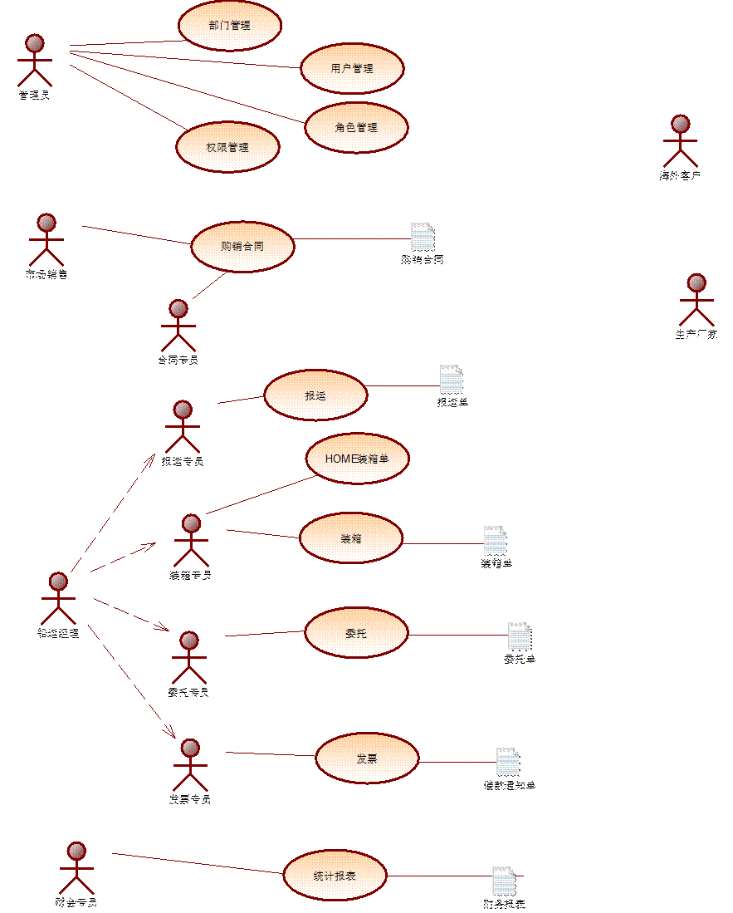

 

 

### 2.2.2   界面原型

[界面原型](界面原型/HTML版本/index.html)它的目的，它给客户提前看未来的系统长什么样子。客户就能有一个直观的印象。

界面原型法，在实际需求调研阶段用的非常多。和用户谈需求并进行记录，跟web前端页面工程师沟通，让其设计出一套相关的页面原型，再拿过去与用户再次进行沟通，并修改进行记录，再回来进行页面的修改，如果确认，将来的页面就基本不再改动。

 

**目的:**

​    **就是在最短的时间里，得到用户最真实的需求。**

 

### 2.2.3   系统功能结构图 

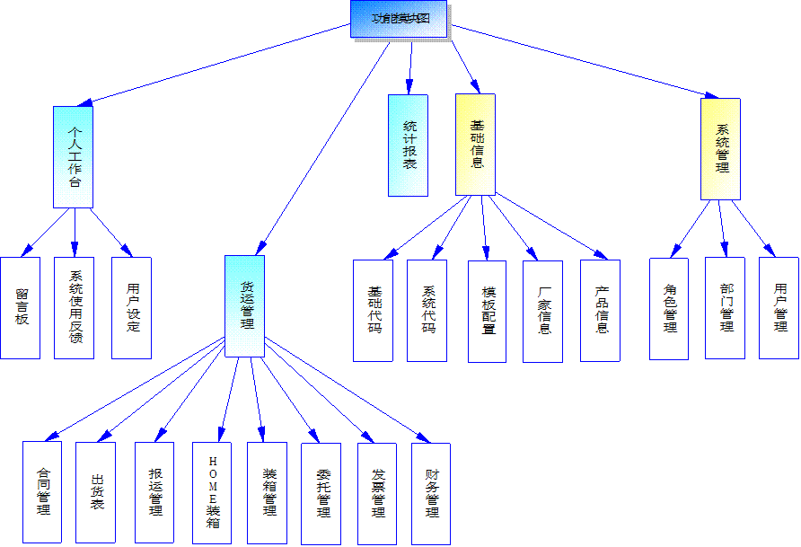

它的作用？

1.功能模块一目了然

2.便于分工

3.便于进行项目报价

## 2.3   项目特色

1.该管理平台采用了当前最流行的SSM进行总体架构，充分利用框架整合后的各种特性，并加入maven进行项目的分模块开发，有效进行项目管理。

2.采用了RBAC认证模型，有效进行用户权限管理，同时加入当前流行的Shiro安全框架，从而使得系统更加安全可靠。

3.结合PowerDesginer引入数据库设计相关理念，及打断设计理论。

4.使用Apache POI实现海量数据导出。

6.利用mybatis逆向工程实现代码自动生成技术，从而解放程序员的部分编码工作。

7.使用EChart形成各种统计图形，从而为高层提供决策支撑。

8.引入JavaMail邮件机制，并实现Spring与JavaMail整合开发，实现邮件发送中加入附件。

9.加入了Quartz实现的定时任务调度，并结合Spring整合好的Mail，很好的解决了报表向公司高层的定时发送功能。

# 3.  工程搭建

## 3.1   开发环境

- idea

- tomcat插件
- jdk1.8
- mysql
- maven
- linux
- nginx
- PowerDeginser
- 逆向工程

## 3.2   工程搭建分析和创建

freight-parent：父工程，打包方式pom，管理jar包的版本号。所有module都应该继承父工程。

​	|-- freight：聚合（pom）

​    	 |-- freight - common：通用的工具类（jar）

​    	 |-- freight - pojo：子工程（jar）

​     	|-- freight - dao：子工程（jar）

​         |-- freight - service：子工程（jar）

​         |-- freight - web：子工程（war）


为什么不在freight-parent定义所有jar包，而是定义版本号呢？

项目部署到tomcat需要打war包，如果这个项目依赖了所有的jar包则会非常大，导致传输非常慢

### 3.2.1 Empty Project 用于存放项目源码

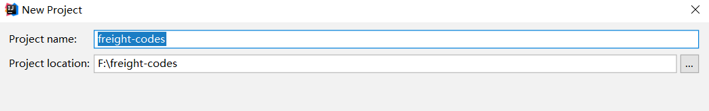

###  3.2.2 创建freight-parent


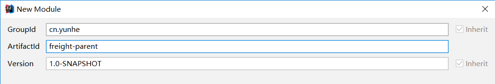

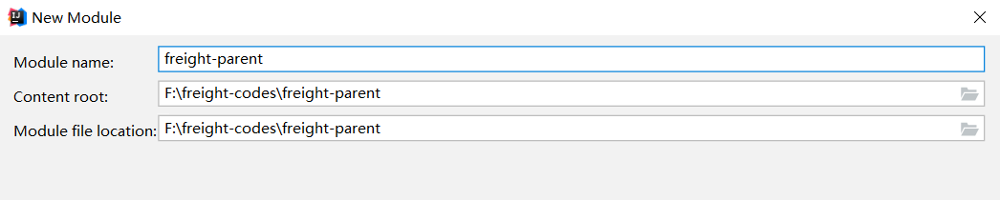

pom.xml

```xml
<?xml version="1.0" encoding="UTF-8"?>
<project xmlns="http://maven.apache.org/POM/4.0.0"
         xmlns:xsi="http://www.w3.org/2001/XMLSchema-instance"
         xsi:schemaLocation="http://maven.apache.org/POM/4.0.0 http://maven.apache.org/xsd/maven-4.0.0.xsd">
    <modelVersion>4.0.0</modelVersion>

    <groupId>cn.yunhe</groupId>
    <artifactId>freight-parent</artifactId>
    <version>1.0-SNAPSHOT</version>
    <packaging>pom</packaging>
    <!-- 集中定义依赖版本号 -->
    <properties>
        <junit.version>4.12</junit.version>
        <spring.version>4.2.4.RELEASE</spring.version>
        <mybatis.version>3.2.8</mybatis.version>
        <mybatis.spring.version>1.2.2</mybatis.spring.version>
        <mybatis.paginator.version>1.2.15</mybatis.paginator.version>
        <mysql.version>5.1.32</mysql.version>
        <slf4j.version>1.6.4</slf4j.version>
        <jackson.version>2.4.2</jackson.version>
        <druid.version>1.0.9</druid.version>
        <httpclient.version>4.3.5</httpclient.version>
        <jstl.version>1.2</jstl.version>
        <servlet-api.version>2.5</servlet-api.version>
        <jsp-api.version>2.0</jsp-api.version>
        <joda-time.version>2.5</joda-time.version>
        <commons-lang3.version>3.3.2</commons-lang3.version>
        <commons-io.version>1.3.2</commons-io.version>
        <commons-net.version>3.3</commons-net.version>
        <pagehelper.version>4.1.6</pagehelper.version>
        <jsqlparser.version>0.9.1</jsqlparser.version>
        <commons-fileupload.version>1.3.1</commons-fileupload.version>
        <shiro.version>1.2.3</shiro.version>
        <ehcache.version>2.10.3</ehcache.version>
    </properties>
    <dependencyManagement>
        <dependencies>
            <!-- 时间操作组件 -->
            <dependency>
                <groupId>joda-time</groupId>
                <artifactId>joda-time</artifactId>
                <version>${joda-time.version}</version>
            </dependency>
            <!-- Apache工具组件 -->
            <dependency>
                <groupId>org.apache.commons</groupId>
                <artifactId>commons-lang3</artifactId>
                <version>${commons-lang3.version}</version>
            </dependency>
            <dependency>
                <groupId>org.apache.commons</groupId>
                <artifactId>commons-io</artifactId>
                <version>${commons-io.version}</version>
            </dependency>
            <dependency>
                <groupId>commons-net</groupId>
                <artifactId>commons-net</artifactId>
                <version>${commons-net.version}</version>
            </dependency>
            <!-- Jackson Json处理工具包 -->
            <dependency>
                <groupId>com.fasterxml.jackson.core</groupId>
                <artifactId>jackson-databind</artifactId>
                <version>${jackson.version}</version>
            </dependency>
            <!-- 单元测试 -->
            <dependency>
                <groupId>junit</groupId>
                <artifactId>junit</artifactId>
                <version>${junit.version}</version>
                <scope>test</scope>
            </dependency>
            <!-- 日志处理 -->
            <dependency>
                <groupId>org.slf4j</groupId>
                <artifactId>slf4j-log4j12</artifactId>
                <version>${slf4j.version}</version>
            </dependency>
            <!-- Mybatis -->
            <dependency>
                <groupId>org.mybatis</groupId>
                <artifactId>mybatis</artifactId>
                <version>${mybatis.version}</version>
            </dependency>
            <dependency>
                <groupId>org.mybatis</groupId>
                <artifactId>mybatis-spring</artifactId>
                <version>${mybatis.spring.version}</version>
            </dependency>
            <dependency>
                <groupId>com.github.miemiedev</groupId>
                <artifactId>mybatis-paginator</artifactId>
                <version>${mybatis.paginator.version}</version>
            </dependency>
            <dependency>
                <groupId>com.github.pagehelper</groupId>
                <artifactId>pagehelper</artifactId>
                <version>${pagehelper.version}</version>
            </dependency>
            <!-- MySql -->
            <dependency>
                <groupId>mysql</groupId>
                <artifactId>mysql-connector-java</artifactId>
                <version>${mysql.version}</version>
            </dependency>
            <!-- 连接池 -->
            <dependency>
                <groupId>com.alibaba</groupId>
                <artifactId>druid</artifactId>
                <version>${druid.version}</version>
            </dependency>
            <!-- Spring -->
            <dependency>
                <groupId>org.springframework</groupId>
                <artifactId>spring-context</artifactId>
                <version>${spring.version}</version>
            </dependency>
            <dependency>
                <groupId>org.springframework</groupId>
                <artifactId>spring-beans</artifactId>
                <version>${spring.version}</version>
            </dependency>
            <dependency>
                <groupId>org.springframework</groupId>
                <artifactId>spring-webmvc</artifactId>
                <version>${spring.version}</version>
            </dependency>
            <dependency>
                <groupId>org.springframework</groupId>
                <artifactId>spring-jdbc</artifactId>
                <version>${spring.version}</version>
            </dependency>
            <dependency>
                <groupId>org.springframework</groupId>
                <artifactId>spring-aspects</artifactId>
                <version>${spring.version}</version>
            </dependency>
            <dependency>
                <groupId>org.springframework</groupId>
                <artifactId>spring-jms</artifactId>
                <version>${spring.version}</version>
            </dependency>
            <dependency>
                <groupId>org.springframework</groupId>
                <artifactId>spring-context-support</artifactId>
                <version>${spring.version}</version>
            </dependency>
            <dependency>
                <groupId>org.springframework</groupId>
                <artifactId>spring-test</artifactId>
                <version>${spring.version}</version>
                <scope>test</scope>
            </dependency>
            <!-- JSP相关 -->
            <dependency>
                <groupId>jstl</groupId>
                <artifactId>jstl</artifactId>
                <version>${jstl.version}</version>
            </dependency>
            <dependency>
                <groupId>javax.servlet</groupId>
                <artifactId>servlet-api</artifactId>
                <version>${servlet-api.version}</version>
                <scope>provided</scope>
            </dependency>
            <dependency>
                <groupId>javax.servlet</groupId>
                <artifactId>jsp-api</artifactId>
                <version>${jsp-api.version}</version>
                <scope>provided</scope>
            </dependency>
            <!-- 文件上传组件 -->
            <dependency>
                <groupId>commons-fileupload</groupId>
                <artifactId>commons-fileupload</artifactId>
                <version>${commons-fileupload.version}</version>
            </dependency>
            <!-- shiro -->
            <dependency>
                <groupId>org.apache.shiro</groupId>
                <artifactId>shiro-all</artifactId>
                <version>${shiro.version}</version>
            </dependency>
            <!-- shiro缓存 -->
            <dependency>
                <groupId>net.sf.ehcache</groupId>
                <artifactId>ehcache</artifactId>
                <version>${ehcache.version}</version>
            </dependency>
        </dependencies>
    </dependencyManagement>

    <build>
        <plugins>
            <!-- 资源文件拷贝插件 -->
            <plugin>
                <groupId>org.apache.maven.plugins</groupId>
                <artifactId>maven-resources-plugin</artifactId>
                <version>2.7</version>
                <configuration>
                    <encoding>UTF-8</encoding>
                </configuration>
            </plugin>
            <!-- java编译插件 -->
            <plugin>
                <groupId>org.apache.maven.plugins</groupId>
                <artifactId>maven-compiler-plugin</artifactId>
                <version>3.2</version>
                <configuration>
                    <source>1.8</source>
                    <target>1.8</target>
                    <encoding>UTF-8</encoding>
                </configuration>
            </plugin>
            <!-- 跳过juint测试 -->
            <plugin>
                <groupId>org.apache.maven.plugins</groupId>
                <artifactId>maven-surefire-plugin</artifactId>
                <version>2.4.2</version>
                <configuration>
                    <skipTests>true</skipTests>
                </configuration>
            </plugin>
        </plugins>
        <pluginManagement>
            <plugins>
                <!-- 配置Tomcat插件 -->
                <plugin>
                    <groupId>org.apache.tomcat.maven</groupId>
                    <artifactId>tomcat7-maven-plugin</artifactId>
                    <version>2.2</version>
                </plugin>
            </plugins>
        </pluginManagement>
        <!-- 如果不添加此节点src/main/java目录下的所有配置文件都会被漏掉。 -->
        <resources>
            <resource>
                <directory>src/main/java</directory>
                <includes>
                    <include>**/*.xml</include>
                </includes>
            </resource>
            <resource>
                <directory>src/main/resources</directory>
                <includes>
                    <include>**/*.xml</include>
                    <include>**/*.properties</include>
                    <include>**/*.ini</include>
                </includes>
            </resource>
        </resources>
    </build>
</project>
```

### 3.2.3  创建freight

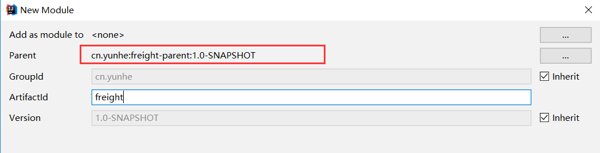

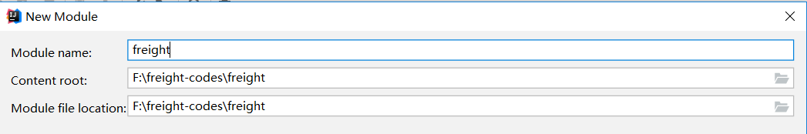

pom.xml

```xml
<?xml version="1.0" encoding="UTF-8"?>
<project xmlns="http://maven.apache.org/POM/4.0.0"
         xmlns:xsi="http://www.w3.org/2001/XMLSchema-instance"
         xsi:schemaLocation="http://maven.apache.org/POM/4.0.0 http://maven.apache.org/xsd/maven-4.0.0.xsd">
    <parent>
        <artifactId>freight-parent</artifactId>
        <groupId>cn.yunhe</groupId>
        <version>1.0-SNAPSHOT</version>
        <relativePath>../freight-parent/pom.xml</relativePath>
    </parent>
    <modelVersion>4.0.0</modelVersion>

    <artifactId>freight</artifactId>


</project>
```

### 3.2.4   创建freight-common

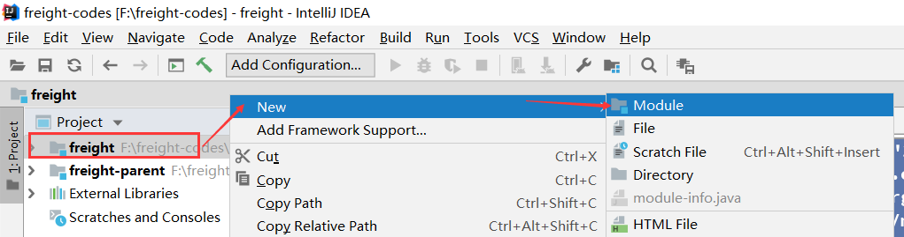

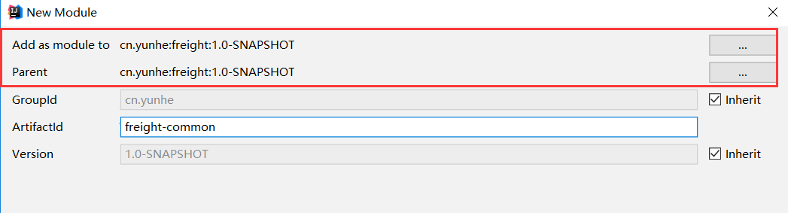

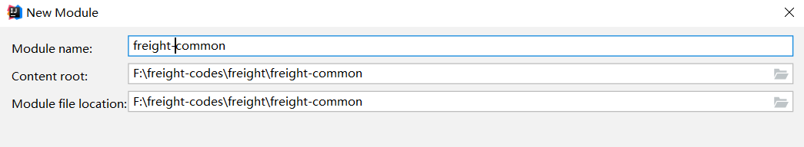

pom.xml

```xml
<?xml version="1.0" encoding="UTF-8"?>
<project xmlns="http://maven.apache.org/POM/4.0.0"
         xmlns:xsi="http://www.w3.org/2001/XMLSchema-instance"
         xsi:schemaLocation="http://maven.apache.org/POM/4.0.0 http://maven.apache.org/xsd/maven-4.0.0.xsd">
    <parent>
        <artifactId>freight</artifactId>
        <groupId>cn.yunhe</groupId>
        <version>1.0-SNAPSHOT</version>
    </parent>
    <modelVersion>4.0.0</modelVersion>

    <artifactId>freight-common</artifactId>


</project>
```

### 3.2.5   创建freight-pojo

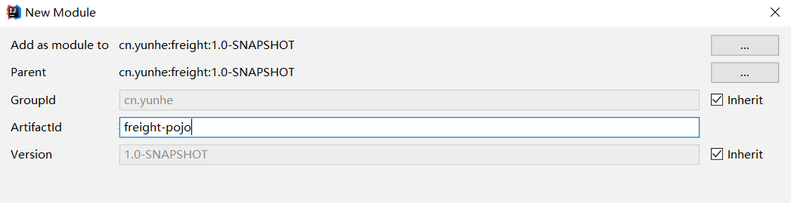

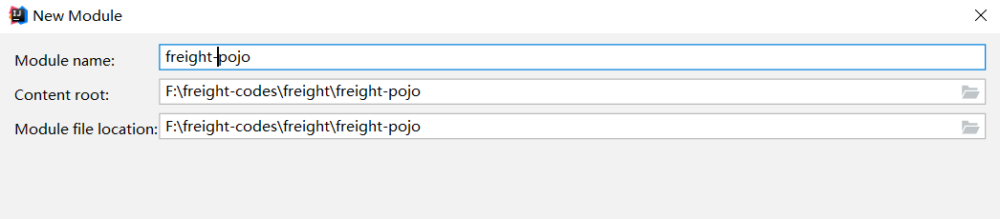

pom.xml

```xml
<?xml version="1.0" encoding="UTF-8"?>
<project xmlns="http://maven.apache.org/POM/4.0.0"
         xmlns:xsi="http://www.w3.org/2001/XMLSchema-instance"
         xsi:schemaLocation="http://maven.apache.org/POM/4.0.0 http://maven.apache.org/xsd/maven-4.0.0.xsd">
    <parent>
        <artifactId>freight</artifactId>
        <groupId>cn.yunhe</groupId>
        <version>1.0-SNAPSHOT</version>
    </parent>
    <modelVersion>4.0.0</modelVersion>

    <artifactId>freight-pojo</artifactId>


</project>
```

### 3.2.6 创建freight-dao

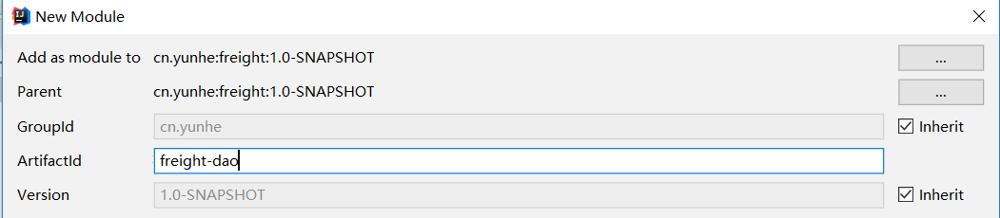

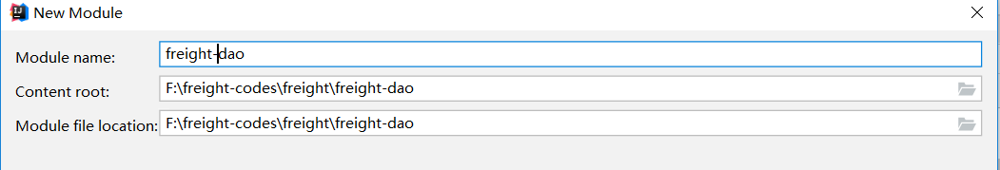

#### 3.2.6.1 pom.xml

```xml
<?xml version="1.0" encoding="UTF-8"?>
<project xmlns="http://maven.apache.org/POM/4.0.0"
         xmlns:xsi="http://www.w3.org/2001/XMLSchema-instance"
         xsi:schemaLocation="http://maven.apache.org/POM/4.0.0 http://maven.apache.org/xsd/maven-4.0.0.xsd">
    <parent>
        <artifactId>freight</artifactId>
        <groupId>cn.yunhe</groupId>
        <version>1.0-SNAPSHOT</version>
    </parent>
    <modelVersion>4.0.0</modelVersion>

    <artifactId>freight-dao</artifactId>
    <dependencies>
        <dependency>
            <groupId>cn.yunhe</groupId>
            <artifactId>freight-pojo</artifactId>
            <version>1.0-SNAPSHOT</version>
        </dependency>
        <!-- 添加mybatis的依赖 -->
        <!-- Mybatis -->
        <dependency>
            <groupId>org.mybatis</groupId>
            <artifactId>mybatis</artifactId>
        </dependency>
        <dependency>
            <groupId>org.mybatis</groupId>
            <artifactId>mybatis-spring</artifactId>
        </dependency>
        <dependency>
            <groupId>com.github.miemiedev</groupId>
            <artifactId>mybatis-paginator</artifactId>
        </dependency>
        <dependency>
            <groupId>com.github.pagehelper</groupId>
            <artifactId>pagehelper</artifactId>
        </dependency>
        <!-- MySql -->
        <dependency>
            <groupId>mysql</groupId>
            <artifactId>mysql-connector-java</artifactId>
        </dependency>
        <!-- 连接池 -->
        <dependency>
            <groupId>com.alibaba</groupId>
            <artifactId>druid</artifactId>
        </dependency>
    </dependencies>

</project>
```

#### 3.2.6.2  db.properties

```properties
jdbc.driver=com.mysql.jdbc.Driver
jdbc.url=jdbc:mysql://localhost:3306/freight?characterEncoding=utf-8
jdbc.username=root
jdbc.password=1111
```

#### 3.2.6.3  SqlMapConfig.xml

```xml
<?xml version="1.0" encoding="UTF-8" ?>
<!DOCTYPE configuration
        PUBLIC "-//mybatis.org//DTD Config 3.0//EN"
        "http://mybatis.org/dtd/mybatis-3-config.dtd">
<configuration>
    <settings>
        <!--延迟加载开关  -->
        <setting name="lazyLoadingEnabled" value="true"/>
        <setting name="aggressiveLazyLoading" value="false"/>
    </settings>

    <!--类型别名  -->
    <typeAliases>
        <package name="cn.yunhe.pojo"/>
    </typeAliases>
</configuration>

```

#### 3.2.6.4   applicationContext-dao.xml  

```xml
<beans xmlns="http://www.springframework.org/schema/beans"
       xmlns:context="http://www.springframework.org/schema/context" xmlns:p="http://www.springframework.org/schema/p"
       xmlns:aop="http://www.springframework.org/schema/aop" xmlns:tx="http://www.springframework.org/schema/tx"
       xmlns:xsi="http://www.w3.org/2001/XMLSchema-instance"
       xsi:schemaLocation="http://www.springframework.org/schema/beans http://www.springframework.org/schema/beans/spring-beans.xsd
   http://www.springframework.org/schema/context http://www.springframework.org/schema/context/spring-context.xsd
   http://www.springframework.org/schema/aop http://www.springframework.org/schema/aop/spring-aop.xsd http://www.springframework.org/schema/tx http://www.springframework.org/schema/tx/spring-tx.xsd
   http://www.springframework.org/schema/util http://www.springframework.org/schema/util/spring-util.xsd">
    <!-- 加载配置文件 -->
    <context:property-placeholder location="classpath:db.properties" />
    <!-- 数据库连接池 -->
    <bean id="dataSource" class="com.alibaba.druid.pool.DruidDataSource"
          destroy-method="close">
        <property name="url" value="${jdbc.url}" />
        <property name="username" value="${jdbc.username}" />
        <property name="password" value="${jdbc.password}" />
        <property name="driverClassName" value="${jdbc.driver}" />
        <property name="maxActive" value="10" />
        <property name="minIdle" value="5" />
    </bean>
    <!-- 让spring管理sqlsessionfactory 使用mybatis和spring整合包中的 -->
    <bean id="sqlSessionFactory" class="org.mybatis.spring.SqlSessionFactoryBean">
        <!-- 数据库连接池 -->
        <property name="dataSource" ref="dataSource" />
        <!-- 加载mybatis的全局配置文件 -->
        <property name="configLocation" value="classpath:SqlMapConfig.xml" />
    </bean>
    <bean class="org.mybatis.spring.mapper.MapperScannerConfigurer">
        <property name="basePackage" value="cn.yunhe.mapper" />
        <property name="sqlSessionFactoryBeanName" value="sqlSessionFactory"></property>
    </bean>
</beans>

```

### 3.2.7  创建freight_service

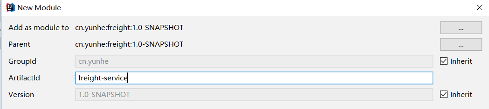

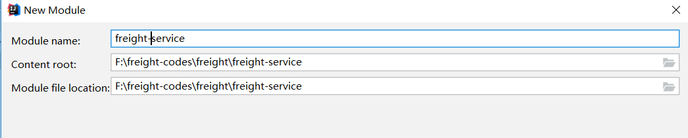

#### 3.2.7.1 pom.xml

```xml
<?xml version="1.0" encoding="UTF-8"?>
<project xmlns="http://maven.apache.org/POM/4.0.0"
         xmlns:xsi="http://www.w3.org/2001/XMLSchema-instance"
         xsi:schemaLocation="http://maven.apache.org/POM/4.0.0 http://maven.apache.org/xsd/maven-4.0.0.xsd">
    <parent>
        <artifactId>freight</artifactId>
        <groupId>cn.yunhe</groupId>
        <version>1.0-SNAPSHOT</version>
    </parent>
    <modelVersion>4.0.0</modelVersion>

    <artifactId>freight_service</artifactId>

    <dependencies>
        <dependency>
            <groupId>cn.yunhe</groupId>
            <artifactId>freight-pojo</artifactId>
            <version>1.0-SNAPSHOT</version>
        </dependency>
        <dependency>
            <groupId>cn.yunhe</groupId>
            <artifactId>freight-dao</artifactId>
            <version>1.0-SNAPSHOT</version>
        </dependency>
        <!-- Spring -->
        <dependency>
            <groupId>org.springframework</groupId>
            <artifactId>spring-context</artifactId>
        </dependency>
        <dependency>
            <groupId>org.springframework</groupId>
            <artifactId>spring-beans</artifactId>
        </dependency>
        <dependency>
            <groupId>org.springframework</groupId>
            <artifactId>spring-webmvc</artifactId>
        </dependency>
        <dependency>
            <groupId>org.springframework</groupId>
            <artifactId>spring-jdbc</artifactId>
        </dependency>
        <dependency>
            <groupId>org.springframework</groupId>
            <artifactId>spring-aspects</artifactId>
        </dependency>
        <dependency>
            <groupId>org.springframework</groupId>
            <artifactId>spring-jms</artifactId>
        </dependency>
        <dependency>
            <groupId>org.springframework</groupId>
            <artifactId>spring-context-support</artifactId>
        </dependency>
    </dependencies>
</project>

```

#### 3.2.7.2  applicationContext-service.xml 

```xml
<?xml version="1.0" encoding="UTF-8"?>
<beans xmlns="http://www.springframework.org/schema/beans"
       xmlns:context="http://www.springframework.org/schema/context" xmlns:p="http://www.springframework.org/schema/p"
       xmlns:aop="http://www.springframework.org/schema/aop" xmlns:tx="http://www.springframework.org/schema/tx"
       xmlns:xsi="http://www.w3.org/2001/XMLSchema-instance"
       xsi:schemaLocation="http://www.springframework.org/schema/beans http://www.springframework.org/schema/beans/spring-beans.xsd
   http://www.springframework.org/schema/context http://www.springframework.org/schema/context/spring-context.xsd
   http://www.springframework.org/schema/aop http://www.springframework.org/schema/aop/spring-aop.xsd http://www.springframework.org/schema/tx http://www.springframework.org/schema/tx/spring-tx.xsd ">

    <context:component-scan base-package="cn.yunhe.service"></context:component-scan>
</beans>

```

#### 3.2.7.3  applicationContext-trans.xml 

```xml
<beans xmlns="http://www.springframework.org/schema/beans"
       xmlns:context="http://www.springframework.org/schema/context" xmlns:p="http://www.springframework.org/schema/p"
       xmlns:aop="http://www.springframework.org/schema/aop" xmlns:tx="http://www.springframework.org/schema/tx"
       xmlns:xsi="http://www.w3.org/2001/XMLSchema-instance"
       xsi:schemaLocation="http://www.springframework.org/schema/beans http://www.springframework.org/schema/beans/spring-beans.xsd
   http://www.springframework.org/schema/context http://www.springframework.org/schema/context/spring-context.xsd
   http://www.springframework.org/schema/aop http://www.springframework.org/schema/aop/spring-aop.xsd http://www.springframework.org/schema/tx http://www.springframework.org/schema/tx/spring-tx.xsd ">
    <!-- 事务管理器 -->
    <bean id="transactionManager"
          class="org.springframework.jdbc.datasource.DataSourceTransactionManager">
        <!-- 数据源 -->
        <property name="dataSource" ref="dataSource" />
    </bean>
    <!-- 通知 -->
    <tx:advice id="txAdvice" transaction-manager="transactionManager">
        <tx:attributes>
            <!-- 传播行为 -->
            <tx:method name="save*" propagation="REQUIRED" />
            <tx:method name="insert*" propagation="REQUIRED" />
            <tx:method name="add*" propagation="REQUIRED" />
            <tx:method name="create*" propagation="REQUIRED" />
            <tx:method name="delete*" propagation="REQUIRED" />
            <tx:method name="update*" propagation="REQUIRED" />
            <tx:method name="find*" propagation="SUPPORTS" read-only="true" />
            <tx:method name="select*" propagation="SUPPORTS" read-only="true" />
            <tx:method name="get*" propagation="SUPPORTS" read-only="true" />
        </tx:attributes>
    </tx:advice>
    <!-- 切面 -->
    <aop:config>
        <aop:advisor advice-ref="txAdvice"
                     pointcut="execution(* cn.yunhe.service.*.*(..))" />
    </aop:config>
</beans>

```


#### 3.2.7.4 使用逆向工程生成代码

> 参考3.3 MyBatis Generator

#### 3.2.7.5   UserService

```java
public interface UserService {
    public UserP login(String username) ;
}
```

#### 3.2.7.6   UserServiceImpl

```java

@Service("userServiceImpl")
public class UserServiceImpl implements UserService {
    @Autowired
    private UserPMapper userPMapper;

    @Override
    public UserP login(String username) {
        UserPExample userPExample = new UserPExample();
        UserPExample.Criteria criteria = userPExample.createCriteria();
        criteria.andUserNameEqualTo(username);
        List<UserP> users = userPMapper.selectByExample(userPExample);
        if(users!=null && users.size()>0){
            return users.get(0);
        }
        return null;
    }
}

```


### 3.2.8  创建freight-web

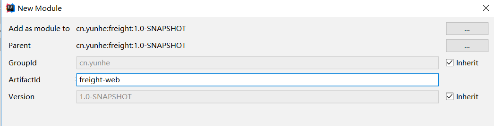

####   3.2.8.1 pom.xml

```xml
<?xml version="1.0" encoding="UTF-8"?>
<project xmlns="http://maven.apache.org/POM/4.0.0"
         xmlns:xsi="http://www.w3.org/2001/XMLSchema-instance"
         xsi:schemaLocation="http://maven.apache.org/POM/4.0.0 http://maven.apache.org/xsd/maven-4.0.0.xsd">
    <parent>
        <artifactId>freight</artifactId>
        <groupId>cn.yunhe</groupId>
        <version>1.0-SNAPSHOT</version>
    </parent>
    <modelVersion>4.0.0</modelVersion>

    <artifactId>freight-web</artifactId>
    <packaging>war</packaging>
    <dependencies>
        <dependency>
            <groupId>cn.yunhe</groupId>
            <artifactId>freight-service</artifactId>
            <version>1.0-SNAPSHOT</version>
        </dependency>
        <!-- Spring -->
        <dependency>
            <groupId>org.springframework</groupId>
            <artifactId>spring-context</artifactId>
        </dependency>
        <dependency>
            <groupId>org.springframework</groupId>
            <artifactId>spring-beans</artifactId>
        </dependency>
        <dependency>
            <groupId>org.springframework</groupId>
            <artifactId>spring-webmvc</artifactId>
        </dependency>
        <dependency>
            <groupId>org.springframework</groupId>
            <artifactId>spring-jdbc</artifactId>
        </dependency>
        <dependency>
            <groupId>org.springframework</groupId>
            <artifactId>spring-aspects</artifactId>
        </dependency>
        <dependency>
            <groupId>org.springframework</groupId>
            <artifactId>spring-jms</artifactId>
        </dependency>
        <dependency>
            <groupId>org.springframework</groupId>
            <artifactId>spring-context-support</artifactId>
        </dependency>
        <!-- JSP相关 -->
        <dependency>
            <groupId>jstl</groupId>
            <artifactId>jstl</artifactId>
        </dependency>
        <dependency>
            <groupId>javax.servlet</groupId>
            <artifactId>servlet-api</artifactId>
            <scope>provided</scope>
        </dependency>
        <dependency>
            <groupId>javax.servlet</groupId>
            <artifactId>jsp-api</artifactId>
            <scope>provided</scope>
        </dependency>
        <!-- Jackson Json处理工具包 -->
        <dependency>
            <groupId>com.fasterxml.jackson.core</groupId>
            <artifactId>jackson-databind</artifactId>
        </dependency>
        <!--日志-->
        <dependency>
            <groupId>org.slf4j</groupId>
            <artifactId>slf4j-log4j12</artifactId>
        </dependency>
        <!-- shiro -->
        <dependency>
            <groupId>org.apache.shiro</groupId>
            <artifactId>shiro-all</artifactId>
        </dependency>
        <!-- shiro缓存 -->
        <dependency>
            <groupId>net.sf.ehcache</groupId>
            <artifactId>ehcache</artifactId>
        </dependency>
    </dependencies>
    <build>
        <plugins>
            <plugin>
                <groupId>org.apache.tomcat.maven</groupId>
                <artifactId>tomcat7-maven-plugin</artifactId>
                <configuration>
                    <path>/</path>
                    <port>8090</port>
                </configuration>
            </plugin>
        </plugins>
    </build>
</project>

```

#### 3.2.8.2 springmvc.xml

```xml
<?xml version="1.0" encoding="UTF-8"?>
<beans xmlns="http://www.springframework.org/schema/beans"
       xmlns:xsi="http://www.w3.org/2001/XMLSchema-instance" xmlns:p="http://www.springframework.org/schema/p"
       xmlns:context="http://www.springframework.org/schema/context"
       xmlns:mvc="http://www.springframework.org/schema/mvc"
       xsi:schemaLocation="http://www.springframework.org/schema/beans http://www.springframework.org/schema/beans/spring-beans.xsd
        http://www.springframework.org/schema/mvc http://www.springframework.org/schema/mvc/spring-mvc.xsd
        http://www.springframework.org/schema/context http://www.springframework.org/schema/context/spring-context.xsd">

    <context:component-scan base-package="cn.yunhe.controller" />
    <mvc:annotation-driven/>
    <bean
            class="org.springframework.web.servlet.view.InternalResourceViewResolver">
        <property name="prefix" value="/WEB-INF/pages/" />
        <property name="suffix" value=".jsp" />
    </bean>

    <!--资源映射器-->
    <mvc:resources location="/images/" mapping="/images/**"/>
    <mvc:resources location="/js/" mapping="/js/**"/>
    <mvc:resources location="/css/" mapping="/css/**"/>

</beans>

```

#### 3.2.8.3 log4j.properties

```properties
log4j.rootLogger=debug, console ,file


log4j.appender.console=org.apache.log4j.ConsoleAppender
log4j.appender.console.layout=org.apache.log4j.PatternLayout
log4j.appender.console.layout.ConversionPattern=%d %-5p [%c] - %m %n

#log4j.appender.file = org.apache.log4j.DailyRollingFileAppender
#log4j.appender.file.File =  log/freight.log
#log4j.appender.file.layout = org.apache.log4j.PatternLayout
#log4j.appender.file.layout.ConversionPattern = %d %-5p [%c] - %m %n

log4j.logger.java.sql.PreparedStatement

```

3.2.8.4 web.xml

```xml
<?xml version="1.0" encoding="UTF-8"?>
<web-app xmlns="http://xmlns.jcp.org/xml/ns/javaee"
         xmlns:xsi="http://www.w3.org/2001/XMLSchema-instance"
         xsi:schemaLocation="http://xmlns.jcp.org/xml/ns/javaee http://xmlns.jcp.org/xml/ns/javaee/web-app_4_0.xsd"
         version="4.0">
    <!-- 加载spring容器 -->
    <context-param>
        <param-name>contextConfigLocation</param-name>
        <param-value>classpath*:applicationContext-*.xml</param-value>
    </context-param>
    <listener>
        <listener-class>org.springframework.web.context.ContextLoaderListener</listener-class>
    </listener>

    <!-- 解决post乱码 -->
    <filter>
        <filter-name>CharacterEncodingFilter</filter-name>
        <filter-class>org.springframework.web.filter.CharacterEncodingFilter</filter-class>
        <init-param>
            <param-name>encoding</param-name>
            <param-value>utf-8</param-value>
        </init-param>
    </filter>
    <filter-mapping>
        <filter-name>CharacterEncodingFilter</filter-name>
        <url-pattern>/*</url-pattern>
    </filter-mapping>


    <!-- springmvc的前端控制器 -->
    <servlet>
        <servlet-name>springmvc</servlet-name>
        <servlet-class>org.springframework.web.servlet.DispatcherServlet</servlet-class>
        <init-param>
            <param-name>contextConfigLocation</param-name>
            <param-value>classpath:springmvc.xml</param-value>
        </init-param>
        <load-on-startup>1</load-on-startup>
    </servlet>
    <servlet-mapping>
        <servlet-name>springmvc</servlet-name>
        <url-pattern>/</url-pattern>
    </servlet-mapping>
</web-app>

```

#### 3.2.8.4  UserController

```java
@Controller
@RequestMapping("/user")
public class UserController {
    @Autowired
    private UserService userService;

    @RequestMapping("/login")
    @ResponseBody
    public UserP login(String username,String password){
        return userService.login(username,password);
    }
}

```

[http://127.0.0.1:8090/user/login?username=lw](http://127.0.0.1:8090/user/login?username=lw&password=7f3d9c154653cf4053f7f277965c2346)

​         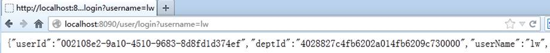  

## 3.3 MyBatis  Generator

 简称MBG，是一个专门为MyBatis框架使用者定制的代码生成器，可以快速的根据表生成对应的映射文件，接口，以及bean类。

 支持基本的增删改查，以及QBC风格的条件查询。

 但是表连接、存储过程等这些复杂sql的定义需要我们手工编写 

> • 官方文档地址 http://www.mybatis.org/generator/ 
>
> • 官方工程地址 https://github.com/mybatis/generator/releases

 使用方式: https://www.cnblogs.com/yadongliang/p/13044174.html