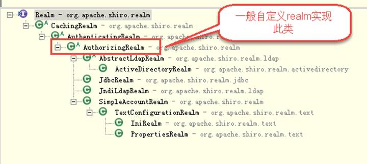

# 1   shiro介绍 (3w1h)

## 1.1  什么是shiro

是apache的一个实现了用户认证、用户授权、加密、会话管理的权限管理的框架。

## 1.2  为什么要学shiro

- spring中有spring security (原名Acegi)，是一个权限框架，它和spring依赖过于紧密，没有shiro使用简单，shiro不依赖于spring（轻量级框架）。

-  shiro不仅可以实现 web应用的权限管理，还可以实现c/s系统，分布式系统权限管理

-  shiro使用简单、灵活有效提高开发效率，从而降低开发成本，越来越多企业项目开始使用shiro。

 

## 1.3  Shiro架构


 

### 1.3.1 Subject

  subject：主体，与应用交互的用户，主体要访问系统，系统需要对主体进行认证、授权。

### 1.3.2 SecurityManager（安全管理器） 

  securityManager：安全管理器，主体进行认证和授权都 是通过securityManager进行。

### 1.3.3 Authenticator（认证器）[ɔ:'θentɪˌkeɪtə]

​     Authenticator即认证器，主体进行认证最终通过authenticator进行的。

### 1.3.4 Authorizer（授权器）['ɔːθəraɪz]

​     Authorizer即授权器，主体进行授权最终通过authorizer进行的。

### 1.3.5 sessionManager（会话管理）

sessionManager即会话管理，如果写过Servlet就应该知道Session的概念，Session呢需要有人去管理它的生命周期，这个组件就是SessionManager；shiro框架定义了一套会话管理，它不依赖web容器的session，所以shiro可以使用在非web应用上，也可以将分布式应用的会话集中在一点管理，此特性可使它实现单点登录。

### 1.3.6 SessionDAO（操作session的一套接口）

  SessionDAO即会话dao，DAO大家都用过，数据访问对象，用于会话的CRUD，比如我们想把Session保存到数据库，那么可以实现自己的SessionDAO，通过如JDBC写到数据库；比如想把Session放到Memcached中，可以实现自己的Memcached SessionDAO；另外SessionDAO中可以使用Cache进行缓存，以提高性能；

### 1.3.7 CacheManager（缓存管理器）

  缓存管理器，来管理如用户、角色、权限等的缓存的；因为这些数据基本上很少去改变，放到缓存中后可以提高访问的性能

### 1.3.8 realm（领域）

​     Realm即领域，相当于datasource数据源，可以是JDBC实现，也可以是LDAP实现，或者内存实现等等，securityManager进行安全认证需要通过Realm获取用户权限数据，比如：如果用户身份数据在数据库那么realm就需要从数据库获取用户身份信息。

​     注意：Shiro不知道你的用户/权限存储在哪及以何种格式存储；所以我们一般在应用中都需要实现自己的Realm；

### 1.3.9 Cryptography（加密） [krɪp'tɑːɡrəfi] 

​     Cryptography即密码管理，shiro提供了一套加密/解密的组件，方便开发。比如提供常用的散列、加/解密等功能。

 

## 1.4  shiro的jar包

​     与其它java开源框架类似，将shiro的jar包加入项目就可以使用shiro提供的功能了。shiro-core是核心包必须选用，还提供了与web整合的shiro-web、与spring整合的shiro-spring下边是shiro各jar包的maven坐标。

```xml
		<dependency>
			<groupId>org.apache.shiro</groupId>
			<artifactId>shiro-core</artifactId>
			<version>1.2.3</version>
		</dependency>
		<dependency>
			<groupId>org.apache.shiro</groupId>
			<artifactId>shiro-web</artifactId>
			<version>1.2.3</version>
		</dependency>
		<dependency>
			<groupId>org.apache.shiro</groupId>
			<artifactId>shiro-spring</artifactId>
			<version>1.2.3</version>
		</dependency>
		<dependency>
			<groupId>org.apache.shiro</groupId>
			<artifactId>shiro-ehcache</artifactId>
			<version>1.2.3</version>
		</dependency>
		<dependency>
			<groupId>org.apache.shiro</groupId>
			<artifactId>shiro-quartz</artifactId>
			<version>1.2.3</version>
		</dependency>

```


也可以通过引入shiro-all包括shiro所有的包：

```xml
<dependency>
			<groupId>org.apache.shiro</groupId>
			<artifactId>shiro-all</artifactId>
			<version>1.2.3</version>
</dependency>

```

日志包：

```xml
<dependency>
    <groupId>commons-logging</groupId>
    <artifactId>commons-logging</artifactId>
    <version>1.2</version>
</dependency>

```


# 2   shiro认证

## 2.1  认证流程

 


 

## 2.2  入门程序（用户登陆和退出）

### 2.2.1 创建工程并添加依赖

```xml
<?xml version="1.0" encoding="UTF-8"?>
<project xmlns="http://maven.apache.org/POM/4.0.0"
         xmlns:xsi="http://www.w3.org/2001/XMLSchema-instance"
         xsi:schemaLocation="http://maven.apache.org/POM/4.0.0 http://maven.apache.org/xsd/maven-4.0.0.xsd">
 
   <artifactId>shiro-demo</artifactId>
   <groupId>cn.yunhe</groupId>
   <version>1.0-SNAPSHOT</version>
    <modelVersion>4.0.0</modelVersion>


    <dependencies>
        <dependency>
            <groupId>org.apache.shiro</groupId>
            <artifactId>shiro-all</artifactId>
            <version>1.2.3</version>
        </dependency>
        <dependency>
            <groupId>org.slf4j</groupId>
            <artifactId>slf4j-log4j12</artifactId>
        </dependency>
        <dependency>
            <groupId>junit</groupId>
            <artifactId>junit</artifactId>
        </dependency>
    </dependencies>
</project>

```


### 2.2.2 log4j.properties日志配置文件

```properties
log4j.rootLogger=debug, stdout
log4j.appender.stdout=org.apache.log4j.ConsoleAppender
log4j.appender.stdout.layout=org.apache.log4j.PatternLayout
log4j.appender.stdout.layout.ConversionPattern=%d %-5p [%c] - %m %n
```


### 2.2.3 shiro.ini

通过Shiro.ini配置文件初始化SecurityManager环境。

创建shiro.ini配置文件，为了方便测试将用户名和密码配置的shiro.ini配置文件中：

```ini
[users]
zhangsan=111
lisi=123

```


安装ini4Idea插件


### 2.2.4 认证代码

1. 构建SecurityManager工厂，IniSecurityManagerFactory可以从ini文件中初始化SecurityManager环境
2. 通过工厂创建SecurityManager
3. 使用SecurityUtils将securityManager设置到运行环境中
4. 使用SecurityUtils创建一个Subject实例，该实例认证要使用上边创建的securityManager进行
5. 创建token令牌，记录用户认证的身份和凭证即账号和密码
6. 用户登录
7. 查看认证状态
8. 退出登录

 

```java
@Test
public void test(){
    //构建SecurityManager工厂，IniSecurityManagerFactory可以从ini文件中初始化SecurityManager环境
    Factory<SecurityManager> factory = new IniSecurityManagerFactory("classpath:shiro.ini");

    // 通过工厂创建SecurityManager
    SecurityManager securityManager = factory.getInstance();
    // 使用SecurityUtils将securityManager设置到运行环境中
    SecurityUtils.setSecurityManager(securityManager);

    // 创建一个Subject实例，该实例认证要使用上边创建的securityManager进行
    Subject subject = SecurityUtils.getSubject();

    // 创建token令牌，记录用户认证的身份和凭证即账号和密码
    UsernamePasswordToken token = new UsernamePasswordToken("zhangsan","123456");

    // 用户登录
    subject.login(token);
    System.out.println();
    // 用户认证状态
    Boolean isAuthenticated = subject.isAuthenticated();
    System.out.println("用户认证状态：" + isAuthenticated);

    // 退出登录
    subject.logout();
    isAuthenticated = subject.isAuthenticated();
    System.out.println("用户认证状态：" + isAuthenticated);
}

```


### 2.2.5 认证执行流程

1、 通过ini配置文件创建securityManager

2、 subject执行login(token)提交认证，最终由securityManager调用Authenticator 

3、 Authenticator调用realm查询用户信息 

4、 realm根据token(usernamePasswordToken)中的账号查询用户信息，如果找不到则给Authenticator**返回null**，如果找到realm则再去匹配密码，匹配密码成功则认证通过。

  

### 2.2.6 常见的异常

- UnknownAccountException   账号不存在异常如下：

  org.apache.shiro.authc.UnknownAccountException: was unable to find account data for the submitted AuthenticationToken

- IncorrectCredentialsException 当输入密码错误会抛此异常，如下：

  org.apache.shiro.authc.IncorrectCredentialsException: Submitted credentials for token [org.apache.shiro.authc.UsernamePasswordToken - zhangsan, rememberMe=false] did not match the expected credentials. 

更多如下：

- DisabledAccountException（帐号被禁用）

- LockedAccountException（帐号被锁定）

- ExcessiveAttemptsException（登录失败次数过多）

- ExpiredCredentialsException（凭证过期）等

### 2.2.7 小结

   

realm：需要根据token中的身份信息去查询数据库（入门程序使用ini配置文件），如果查到用户返回认证信息，如果查询不到返回null。

## 2.3  自定义Realm


​     上边的程序使用的是Shiro自带的IniRealm，IniRealm从ini配置文件中读取用户的信息，大部分情况下需要从系统的数据库中读取用户信息，所以需要自定义realm。

### 2.3.1 shiro提供的realm



 

最基础的是Realm接口，CachingRealm负责缓存处理，AuthenticationRealm负责认证，通常自定义的realm继承AuthorizingRealm。

 

### 2.3.2 自定义Realm

1. 继承AuthorizingRealm
2. 从token中获取用户的身份信息
3. 根据身份信息(用户名)从数据库获取用户的凭证信息(密码)
4. 将token中用户的身份信息和数据库中用户的凭证信息封装到SimpleAuthenticationInfo实例中
5. 返回简单认证信息类的实例simpleAuthenticationInfo

```java
public class ShiroJdbcRealm extends AuthorizingRealm {
    /**
     * 认证
     * @param token
     * @return
     * @throws AuthenticationException
     */
    @Override
    protected AuthenticationInfo doGetAuthenticationInfo(AuthenticationToken token)
            throws AuthenticationException {
        String username = (String) token.getPrincipal();
	//利用jdbc根据用户名查询密码
        SimpleAuthenticationInfo simpleAuthenticationInfo = new SimpleAuthenticationInfo(username, "1234567", this.getName());
        return simpleAuthenticationInfo;
    }

    /**
     * 授权
     * @param principalCollection
     * @return
     */
    @Override
    protected AuthorizationInfo doGetAuthorizationInfo(PrincipalCollection principalCollection) {
        return null;
    }
}


```


### 2.3.3 shiro-realm.ini


```ini
[main]
#自定义 realm
shiroJdbcRealm=cn.yunhe.shiro.ShiroJdbcRealm
#将realm设置到securityManager
securityManager.realms=$shiroJdbcRealm

```

思考：这里为什么不用配置[users]了？？

 

### 2.3.4 测试代码

测试代码同入门程序，将ini的地址修改为shiro- realm.ini。

分别模拟账号不存在、密码错误、账号和密码正确进行测试。

 

## 2.4  散列算法

- 散列算法常用于对密码进行散列，常用的散列算法有MD5、SHA，散列算法不可逆。

- md5密码，如果知道散列后的值可以通过穷举算法，得到md5密码对应的明文。

-  建议对md5进行散列时加salt（盐），进行加密相当 于对原始密码+盐进行散列。


一般散列算法需要提供一个salt（盐）与原始内容生成摘要信息，这样做的目的是为了安全性，比如：111111的md5值是：96e79218965eb72c92a549dd5a330112，拿着“96e79218965eb72c92a549dd5a330112”去md5破解网站很容易进行破解，如果要是对111111和salt（盐，一个随机数）进行散列，这样虽然密码都是111111加不同的盐会生成不同的散列值。

 

### 2.4.1 例子


```java
@Test
public void testMD5(){
    //md5加密，不加盐
    String password_md5 = new Md5Hash("111111").toString();
    System.out.println("md5加密，不加盐="+password_md5);
    //md5加密，加盐，一次散列
    String password_md5_sale_1 = new Md5Hash("111111", "yunhe", 1).toString();
    System.out.println("password_md5_sale_1="+password_md5_sale_1);
    String password_md5_sale_2 = new Md5Hash("111111", "yunhe", 2).toString();
    System.out.println("password_md5_sale_2="+password_md5_sale_2);
    //两次散列相当于md5(md5())
    //使用SimpleHash
    String simpleHash = new SimpleHash("MD5", "111111", "eteokues",1).toString();
    System.out.println(simpleHash);
}

```


### 2.4.2 在realm中使用

​     实际应用是将盐和散列后的值存在数据库中，自动realm从数据库取出盐和加密后的值由shiro完成密码校验。

1.  继承AuthorizingRealm
2. 从token中获取用户的身份信息
3. 根据身份信息从数据库获取用户的凭证信息
4. 根据身份信息从数据库获取用户的salt
5. 将token中用户的身份信息和数据库中用户的凭证信息封装到SimpleAuthenticationInfo实例中
6. 返回简单认证信息类的实例simpleAuthenticationInfo

//123456 加盐 ak47 691cc147ec1e00c3295e1f30bfb142a3

#### 2.4.2.1自定义realm

```java 
public class ShiroHashRelam extends AuthorizingRealm {
    /**
     * 认证
     * @param token
     * @return
     * @throws AuthenticationException
     */
    @Override
    protected AuthenticationInfo doGetAuthenticationInfo(AuthenticationToken token)
            throws AuthenticationException {
        //1、继承AuthorizingRealm
        //2、从token中获取用户的身份信息
        //3、根据身份信息从数据库获取用户的凭证信息
        //4、将token中用户的身份信息和数据库中用户的凭证信息封装到SimpleAuthenticationInfo实例中
        //5、返回简单认证信息类的实例,使用ByteSource加盐 simpleAuthenticationInfo
        String username = (String) token.getPrincipal();
        //模拟从数据库获取用户凭证信息(password)和salt
        String password = "691cc147ec1e00c3295e1f30bfb142a3";
        String salt = "ak47";
        SimpleAuthenticationInfo simpleAuthenticationInfo =
                new SimpleAuthenticationInfo(username, "691cc147ec1e00c3295e1f30bfb142a3", ByteSource.Util.bytes(salt),this.getName());
        return simpleAuthenticationInfo;
    }

    /**
     * 授权
     * @param principal
     * @return
     */
    @Override
    protected AuthorizationInfo doGetAuthorizationInfo(PrincipalCollection principal) {
        return null;
    }
}


```

#### 2.4.2.2shiro-hash.ini


```ini
[main]
#定义凭证匹配器
credentialsMatcher=org.apache.shiro.authc.credential.HashedCredentialsMatcher
#散列算法
credentialsMatcher.hashAlgorithmName=md5
#散列次数
credentialsMatcher.hashIterations=1
#将凭证匹配器设置到realm
hashRealm=cn.yunhe.shiro.ShiroHashRelam
hashRealm.credentialsMatcher=$credentialsMatcher
securityManager.realms=$hashRealm

```


#### 2.4.2.3测试代码

测试代码同上个章节，注意修改ini路径。

 

# 3   shiro授权

## 3.1  授权流程


 

## 3.2  授权方式

Shiro 支持三种方式的授权：

- 编程式：通过写if/else 授权代码块完成：

  ```java
  Subject subject = SecurityUtils.getSubject();
  if(subject.hasRole(“admin”)) {
  	//有权限
  } else {
  	//无权限
  }
  ```

  

- 注解式：通过在执行的Java方法上放置相应的注解完成：

  ```java
  @RequiresRoles("admin")
  public void hello() {
     //有权限
  }
  ```

  

- JSP/GSP 标签：在JSP/GSP 页面通过相应的标签完成：

  ```jsp
<shiro: hasPermission name="权限标识">
   <!—- 有权限—->
</shiro: hasPermission >
  ```
  
  

本教程序授权测试使用第一种编程方式，实际与web系统集成使用后两种方式。

 

## 3.3  授权测试

### 3.3.1 shiro-permission.ini

创建存放权限的配置文件shiro-permission.ini，如下：


```ini
[users]
#用户zhangsan的密码是123456，此用户具有role1和role2两个角色
zhangsan=123456,role1,role2
lisi=123456,role3
[roles]
#角色role1对资源user拥有create、update权限
role1=user:create,user:update
#角色role2对资源user拥有create、delete权限
role2=user:create,user:delete
#角色role3对资源user拥有create权限
role3=user:create
```


**权限标识符号规则：**

- user:update:01-->表示对用户资源的01实例进行update操作。

- user: update-->表示对用户资源进行update操作，相当于user: update:*，对所有用户资源实例进行create操作。

- user:*:01-->表示对用户资源实例01进行所有操作。

 

测试代码同认证代码，注意ini地址改为shiro-permission.ini，主要学习下边授权的方法，注意：在用户认证通过后执行下边的授权代码。

```java
@Test
    public void test() {
//        1、构建SecurityManager工厂，IniSecurityManagerFactory可以从ini文件中初始化SecurityManager环境
        Factory<SecurityManager> factory = new IniSecurityManagerFactory("classpath:shiro_permission.ini");
//        2、通过工厂创建SecurityManager
        SecurityManager securityManager = factory.getInstance();
//        3、使用SecurityUtils将securityManager设置到运行环境中
        SecurityUtils.setSecurityManager(securityManager);
//        4、创建一个Subject实例，该实例认证要使用上边创建的securityManager进行
        Subject subject = SecurityUtils.getSubject();
//        5、创建token令牌，记录用户认证的身份和凭证即账号和密码
        UsernamePasswordToken token = new UsernamePasswordToken("zhangsan","123456");
//        6、用户登录
        subject.login(token);
//        7、查看认证状态
        Boolean isAnthenticated = subject.isAuthenticated();
        System.out.println(isAnthenticated);

        // 用户授权检测 基于角色授权
        // 是否有某一个角色
        System.out.println("用户是否拥有一个角色：" + subject.hasRole("role1"));
        // 是否有多个角色
        System.out.println("用户是否拥有多个角色：" + subject.hasAllRoles(Arrays.asList("role1", "role2")));
//    subject.checkRole("role1");
//    subject.checkRoles(Arrays.asList("role1", "role2"));
        // 授权检测，失败则抛出异常
        // subject.checkRole("role22");
        // 基于资源授权
        System.out.println("是否拥有某一个权限：" + subject.isPermitted("user:delete"));
        System.out.println("是否拥有多个权限：" + subject.isPermittedAll("user:create", "user:delete"));
        //检查权限
        subject.checkPermission("user:delete");
        subject.checkPermissions("user:create","user:delete");
    }
}

```


### 3.3.2 基于角色的授权


```java 
// 用户授权检测 基于角色授权
// 是否有某一个角色
System.out.println("用户是否拥有一个角色：" + subject.hasRole("role1"));
// 是否有多个角色
System.out.println("用户是否拥有多个角色：" + subject.hasAllRoles(Arrays.asList("role1", "role2")));

```

对应的check方法：

```java
subject.checkRole("role1");
subject.checkRoles(Arrays.asList("role1", "role2"));
```

上边check方法如果授权失败则抛出异常：

org.apache.shiro.authz.UnauthorizedException: Subject does not have role [.....]

 

### 3.3.3 基于资源授权

```java
// 基于资源授权
System.out.println("是否拥有某一个权限：" + 
                             subject.isPermitted("user:delete"));
System.out.println("是否拥有多个权限：" +
                 subject.isPermittedAll("user:create:1","user:delete"));

```

对应的check方法：

```java
subject.checkPermission("sys:user:delete");
subject.checkPermissions("user:create:1","user:delete");
```

 

上边check方法如果授权失败则抛出异常：

org.apache.shiro.authz.UnauthorizedException: Subject does not have permission [....]

## 3.4  自定义realm

实际开发中从数据库中获取权限数据。就需要自定义realm，由realm从数据库查询权限数据。realm根据用户身份查询权限数据，将权限数据返回给authorizer（授权器）。

### 3.4.1 realm代码

​     在认证章节写的自定义CustomRealm类中完善doGetAuthorizationInfo方法，此方法需要完成：根据用户身份信息从数据库查询权限字符串，由shiro进行授权。

```java
public class ShiroRelam extends AuthorizingRealm {
    /**
     * 认证
     *
     * @param token
     * @return
     * @throws AuthenticationException
     */
    @Override
    protected AuthenticationInfo doGetAuthenticationInfo(AuthenticationToken token)
            throws AuthenticationException {
        //1、继承AuthenticatingRealm
        //2、从token中获取用户的身份信息
        //3、根据身份信息从数据库获取用户的凭证信息
        //4、将token中用户的身份信息和数据库中用户的凭证信息封装到SimpleAuthenticationInfo实例中
        //5、返回简单认证信息类的实例,使用ByteSource加盐 simpleAuthenticationInfo
        String account = (String) token.getPrincipal();
        //JDBC访问数据库从数据库获取用户凭证信息(password)和salt
        String[] info = this.getUserInfoByAccount(account);
        String password = info[0];
        String salt = info[1];
        SimpleAuthenticationInfo simpleAuthenticationInfo =
                new SimpleAuthenticationInfo(account, password, ByteSource.Util.bytes(salt), this.getName());
        return simpleAuthenticationInfo;
    }

    /**
     * 授权
     * @param principals
     * @return
     */
    @Override
    protected AuthorizationInfo doGetAuthorizationInfo(PrincipalCollection principals) {
        // 获取身份信息
        String account = (String) principals.getPrimaryPrincipal();
        SimpleAuthorizationInfo info = new SimpleAuthorizationInfo();
        // 根据身份信息从数据库中查询权限数据
        //将角色信息封闭为AuthorizationInfo
        Set<String> roles = getUserRolesByAccount(account);
        info.addRoles(roles);
        //将权限信息封闭为AuthorizationInfo
        Set<String> permissions = getUserPermissionsByAccount(account);
        info.addStringPermissions(permissions);
        return info;

    }

    /**
     * 通过账号获取用户的权限信息
     * @param account
     * @return
     */
    private Set<String> getUserPermissionsByAccount(String account) {
        String sql =
                "SELECT sr.resource_permission FROM sys_resource sr\n" +
                        "  LEFT JOIN sys_role_resource srr ON sr.resource_id = srr.resource_id\n" +
                        "  LEFT JOIN sys_user_role sru ON sru.role_id = srr.role_id\n" +
                        "  LEFT JOIN sys_user su ON su.user_id = sru.user_id\n" +
                        "WHERE su.account = ?";

        try {
            Class.forName("com.mysql.jdbc.Driver");
            String url = "jdbc:mysql://localhost:3306/shiro";
            Connection conn = DriverManager.getConnection(url, "root", "123456");
            PreparedStatement ps = conn.prepareStatement(sql);
            ps.setString(1, account);
            ResultSet rs = ps.executeQuery();
            Set<String> set = new HashSet<>();
            if (rs.next()) {
                set.add(rs.getString(1));
            }
            return set;
        } catch (ClassNotFoundException e) {
            e.printStackTrace();
        } catch (SQLException e) {
            e.printStackTrace();
        }
        return null;
    }

    /**
     * 通过账号获取用户的角色信息
     *
     * @param account
     * @return
     */
    private Set<String> getUserRolesByAccount(String account) {
        String sql =
                "SELECT sr.role_name FROM sys_role sr\n" +
                        "  LEFT JOIN sys_user_role sur ON sur.role_id = sr.role_id\n" +
                        "  LEFT JOIN sys_user su ON su.user_id = sur.user_id\n" +
                        "WHERE su.account = ?";

        try {
            Class.forName("com.mysql.jdbc.Driver");
            String url = "jdbc:mysql://localhost:3306/shiro";
            Connection conn = DriverManager.getConnection(url, "root", "123456");
            PreparedStatement ps = conn.prepareStatement(sql);
            ps.setString(1, account);
            ResultSet rs = ps.executeQuery();
            Set<String> set = new HashSet<>();
            if (rs.next()) {
                set.add(rs.getString(1));
            }
            return set;
        } catch (ClassNotFoundException e) {
            e.printStackTrace();
        } catch (SQLException e) {
            e.printStackTrace();
        }
        return null;
    }

    /**
     * 通过账号获取用户的认证信息
     *
     * @param account
     * @return
     */
    private String[] getUserInfoByAccount(String account) {
        try {
            Class.forName("com.mysql.jdbc.Driver");
            String url = "jdbc:mysql://localhost:3306/shiro";
            Connection conn = DriverManager.getConnection(url, "root", "123456");
            String sql = "select password,salt from sys_user where account = ?";
            PreparedStatement ps = conn.prepareStatement(sql);
            ps.setString(1, account);
            ResultSet rs = ps.executeQuery();
            String[] array = new String[2];
            if (rs.next()) {
                array[0] = rs.getString("password");
                array[1] = rs.getString("salt");
            }
            return array;
        } catch (ClassNotFoundException e) {
            e.printStackTrace();
        } catch (SQLException e) {
            e.printStackTrace();
        }
        return null;
    }
}

```


### 3.4.2 shiro-realm.ini

ini配置文件还使用认证阶段使用的，不用改变。

```ini
[main]
#定义凭证匹配器
credentialsMatcher=org.apache.shiro.authc.credential.HashedCredentialsMatcher
#散列算法
credentialsMatcher.hashAlgorithmName=md5
#散列次数
credentialsMatcher.hashIterations=3
#将凭证匹配器设置到realm
customRealm=cn.yunhe.shiro.ShiroRelam
customRealm.credentialsMatcher=$credentialsMatcher
securityManager.realms=$customRealm

```

思考：shiro-permission.ini中的[roles]为什么不需要了？？

 

### 3.4.3 测试代码

同上边的授权测试代码，注意修改ini地址为shiro-realm.ini。

 ```java
public class ShiroRelamTest {

    @Test
    public void test() {
//        1、构建SecurityManager工厂，IniSecurityManagerFactory可以从ini文件中初始化SecurityManager环境
        Factory<SecurityManager> factory = new IniSecurityManagerFactory("classpath:shiro_realm.ini");
//        2、通过工厂创建SecurityManager
        SecurityManager securityManager = factory.getInstance();
//        3、使用SecurityUtils将securityManager设置到运行环境中
        SecurityUtils.setSecurityManager(securityManager);
//        4、创建一个Subject实例，该实例认证要使用上边创建的securityManager进行
        Subject subject = SecurityUtils.getSubject();
//        5、创建token令牌，记录用户认证的身份和凭证即账号和密码
        UsernamePasswordToken token = new UsernamePasswordToken("admin","admin");
//        6、用户登录
        subject.login(token);
//        7、查看认证状态
        Boolean isAnthenticated = subject.isAuthenticated();
        System.out.println(isAnthenticated);
//        8、退出登录
        subject.logout();
        isAnthenticated = subject.isAuthenticated();
        System.out.println(isAnthenticated);
    }
}

 ```


### 3.4.4 授权执行流程

1、 执行subject.isPermitted("user:create")

2、 securityManager通过ModularRealmAuthorizer进行授权

3、 ModularRealmAuthorizer调用realm获取权限信息

4、 ModularRealmAuthorizer再通过permissionResolver解析权限字符串，校验是否匹配

 

# 4   shiro与项目集成开发

## 4.1  shiro与spring web项目整合

### 4.1.1 修改pom.xml,添加依赖

```xm
<dependencies>
        <!-- JSP相关 -->
        <dependency>
            <groupId>jstl</groupId>
            <artifactId>jstl</artifactId>
        </dependency>
        <dependency>
            <groupId>javax.servlet</groupId>
            <artifactId>servlet-api</artifactId>
            <scope>provided</scope>
        </dependency>
        <dependency>
            <groupId>javax.servlet</groupId>
            <artifactId>jsp-api</artifactId>
            <scope>provided</scope>
        </dependency>
        <!-- Spring -->
        <dependency>
            <groupId>org.springframework</groupId>
            <artifactId>spring-context</artifactId>
        </dependency>
        <dependency>
            <groupId>org.springframework</groupId>
            <artifactId>spring-beans</artifactId>
        </dependency>
        <dependency>
            <groupId>org.springframework</groupId>
            <artifactId>spring-webmvc</artifactId>
        </dependency>
        <dependency>
            <groupId>org.springframework</groupId>
            <artifactId>spring-jdbc</artifactId>
        </dependency>
        <dependency>
            <groupId>org.springframework</groupId>
            <artifactId>spring-aspects</artifactId>
        </dependency>
        <dependency>
            <groupId>org.springframework</groupId>
            <artifactId>spring-context-support</artifactId>
        </dependency>
        <!-- Jackson Json处理工具包 -->
        <dependency>
            <groupId>com.fasterxml.jackson.core</groupId>
            <artifactId>jackson-databind</artifactId>
            <version>${jackson.version}</version>
        </dependency>
        <!-- Mybatis -->
        <dependency>
            <groupId>org.mybatis</groupId>
            <artifactId>mybatis</artifactId>
        </dependency>
        <dependency>
            <groupId>org.mybatis</groupId>
            <artifactId>mybatis-spring</artifactId>
        </dependency>
        <dependency>
            <groupId>com.github.miemiedev</groupId>
            <artifactId>mybatis-paginator</artifactId>
        </dependency>
        <dependency>
            <groupId>com.github.pagehelper</groupId>
            <artifactId>pagehelper</artifactId>
        </dependency>
        <!-- MySql -->
        <dependency>
            <groupId>mysql</groupId>
            <artifactId>mysql-connector-java</artifactId>
        </dependency>
        <!-- 连接池 -->
        <dependency>
            <groupId>com.alibaba</groupId>
            <artifactId>druid</artifactId>
        </dependency>
        <!-- 日志处理 -->
        <dependency>
            <groupId>org.slf4j</groupId>
            <artifactId>slf4j-log4j12</artifactId>
        </dependency>
        <dependency>
            <groupId>org.apache.commons</groupId>
            <artifactId>commons-lang3</artifactId>
        </dependency>
        <dependency>
            <groupId>org.apache.shiro</groupId>
            <artifactId>shiro-all</artifactId>
            <version>1.2.3</version>
        </dependency>
    </dependencies>

```

### 4.1.2 web.xml添加shiro Filter

```xml
<!--
   DelegatingFilterProxy：类是一个代理类，所有的请求都会首先发到这个filter代理然后再按照   
       "filter-name"委派到spring中的这个bean。在Spring中配置的bean的name要和web.xml  
       中的<filter-name>一样.
   targetFilterLifecycle：是否由spring来管理bean的生命周期
-->
<filter>
    <filter-name>shiroFilter</filter-name>
   <filter-class>org.springframework.web.filter.DelegatingFilterProxy</filter-class>
    <init-param>
        <param-name>targetFilterLifecycle</param-name>
        <param-value>true</param-value>
    </init-param>
    <init-param>
        <!--设置spring容器filter的bean id,如果不设置会找filter-name -->
        <param-name>targetBeanName</param-name>
        <param-value>shiroFilter</param-value>
    </init-param>
</filter>
<filter-mapping>
    <filter-name>shiroFilter</filter-name>
    <url-pattern>/*</url-pattern>
</filter-mapping>

```

### 4.1.3 applicationContext-shiro.xml

```xml
<beans xmlns:xsi="http://www.w3.org/2001/XMLSchema-instance"
       xmlns="http://www.springframework.org/schema/beans"
       xsi:schemaLocation="http://www.springframework.org/schema/beans
       http://www.springframework.org/schema/beans/spring-beans.xsd">

    <!--让spring初始化一个shiro的安全管理器-->
    <bean id="securityManager" class="org.apache.shiro.web.mgt.DefaultWebSecurityManager">
        <!--注入我们自定的realm-->
        <property name="realm" ref="shiroRealm"/>
    </bean>
    <!--自定的relam 从数据库访问用户的认证和授权信息-->
    <bean id="shiroRealm" class="cn.yunhe.shiro.realm.ShiroRelam">
        <property name="credentialsMatcher" ref="credentialsMatcher"/>
    </bean>
    <!--初始化一个凭证管理器，设置密码的加密算法和规则-->
    <bean id="credentialsMatcher" class="org.apache.shiro.authc.credential.HashedCredentialsMatcher">
        <property name="hashAlgorithmName" value="md5"/>
        <property name="hashIterations" value="1"/>
    </bean>
    
    <!-- Shiro 的Web过滤器 -->
    <bean id="shiroFilter" class="org.apache.shiro.spring.web.ShiroFilterFactoryBean">
        <property name="securityManager" ref="securityManager"/>
        <!-- 如果没有认证将要跳转的登陆地址，http可访问的url，
        如果不在表单认证过虑器FormAuthenticationFilter中指, 定此地址就为身份认证地址 -->
        <property name="loginUrl" value="/login"/>
        <!--登录成功的地址-->
        <property name="successUrl" value="/"/>
        <!-- 没有权限跳转的地址 -->
        <property name="unauthorizedUrl" value="/noauth"/>

        <!-- shiro过滤器配置 -->
        <property name="filters">
            <map>
                <entry key="authc" value-ref="formAuthenticationFilter"/>
            </map>
        </property>
        <!-- 配置安全规则 -->
        <property name="filterChainDefinitions">
            <value>
                <!-- 必须通过身份认证方可访问，身份认证的url必须和过虑器中指定的loginUrl一致 -->
                /login = authc
                <!-- 退出拦截，请求logout执行退出操作 -->
                /logout = logout
                <!-- 无权访问页面 -->
                /noauth = anon
                <!--静态资源可以直接访问-->
                /static/** = anon
                <!-- user表示身份认证通过或通过记住我认证通过的可以访问 -->
                /** = user
            </value>
        </property>
    </bean>

    <!-- 基于Form表单的身份验证过滤器，
         不配置将也会注册此过虑器，表单中的用户账号、密码及loginurl将采用默认值
         建议配置 -->
    <bean id="formAuthenticationFilter"
          class="org.apache.shiro.web.filter.authc.FormAuthenticationFilter">
        <!-- 表单中账号的input名称 -->
        <property name="usernameParam" value="username"/>
        <!-- 表单中密码的input名称 -->
        <property name="passwordParam" value="password"/>
        <!-- <property name="rememberMeParam" value="rememberMe"/> -->
        <!-- loginurl：用户登陆地址-->
        <property name="loginUrl" value="/login"/>
    </bean>
    
</beans>
```


### 4.1.4 登录

#### 4.1.4.1登陆页面login.jsp

```jsp
<body>
<div  class="easyui-dialog" title="登录" style="padding-top:100px;width:300px;height:180px;"
      data-options="closable:false,modal:true,draggable:false">
    <form id="login" action="/user/login" method="post"style="padding:10px 20px 10px 40px;">
        <p>账号: <input class="easyui-validatebox" name="username" ></p>
        <p>密码: <input class="easyui-validatebox"  name="password"></p>
        <div style="text-align:center;padding:5px">
            <a href="javascript:void(0)" class="easyui-linkbutton" 
data-options="iconCls:'icon-ok'" onclick="submitForm()">登录</a>
            <a href="javascript:void(0)" class="easyui-linkbutton" data-options="iconCls:'icon-clear'" onclick="clearForm()">重置</a>
        </div>
    </form>
</div>
</body>
<script type="text/javascript">
    function clearForm(){
        $('#login').form('clear');
    }
    function submitForm(){
        $('#login').submit();
    }
</script>
</html>

```


#### 4.1.4.2重写登录方法

```java
@Controller
public class LoginController {


    @Autowired
    private SysService sysService;


      /**
     * 认证：注意认证成功不调用该方法
     * @param request
     * @return
     */
    @RequestMapping("/login")
    public String login(Model model,HttpServletRequest request){
        String shiroLoginFailure = (String) request.getAttribute("shiroLoginFailure");

        if(UnknownAccountException.class.getName().equals(shiroLoginFailure)){
            model.addAttribute("errorInfo","账号不存在！！！");
        }else if(IncorrectCredentialsException.class.getName().equals(shiroLoginFailure)){
            model.addAttribute("errorInfo","密码错误！！！");
        }
        //返回到登录页面
        return "/index";
    }


    /**
     * 认证通过时，shiro框架请求该方法跳转到系统主页
     *
     * @return
     */
    @RequestMapping(value = "/")
    public String index() {
        return "index";
    }
}


```

```java
@Controller
public class PageController {
    //欢迎页
    @RequestMapping("/{page}")
    public String showPage(@PathVariable String page){
        return page;
    }
}

```


#### 4.1.4.4 原理

使用FormAuthenticationFilter过虑器实现 ，原理如下：

 

将用户没有认证时，请求loginurl进行认证，用户身份和用户密码提交数据到loginurl

FormAuthenticationFilter拦截住取出request中的username和password（两个参数名称是可以配置的）

FormAuthenticationFilter调用realm传入一个token（username和password）

realm认证时根据username查询用户信息（在user中存储，包括 userid、username、password、menus）。

如果查询不到，realm返回null，FormAuthenticationFilter向request域中填充一个参数（记录了异常信息）

 


### 4.1.5 退出

#### 4.1.5.1配置shiro的logout 

```xml
<!--请求/user/logout执行退出操作 -->
/user/logout = logout
```


#### 4.1.5.2原理


### 4.1.7 首页

#### 4.1.7.1自定义realm

此realm先不从数据库查询权限数据，当前需要先将shiro整合完成，在上边章节定义的realm基础上修改。


 ```java
public class CustomRealm extends AuthorizingRealm {
    //授权
    @Override
    protected AuthorizationInfo doGetAuthorizationInfo(PrincipalCollection principals) {
        return null;
    }

    //认证
    @Override
    protected AuthenticationInfo doGetAuthenticationInfo(AuthenticationToken token) throws AuthenticationException {
        //从token中 获取用户身份信息
        String username = (String) token.getPrincipal();
        //拿username从数据库中查询
        //....
        //如果查询不到则返回null
        if(!username.equals("zs")){//这里模拟查询不到
            return null;
        }

        //获取从数据库查询出来的用户密码
        String password = "111";//这里使用静态数据模拟。。

        // 根据用户id从数据库取出菜单 ...先用静态数据
        //一级菜单
        List<SysPermissionVo> pmenus = new ArrayList<SysPermissionVo>();
        SysPermissionVo pmenu = new SysPermissionVo();
        pmenu.setName("员工管理");

        //二级菜单
        List<SysPermission> menus = new ArrayList<SysPermission>();
        SysPermission menu_1 = new SysPermission();
        menu_1.setName("员工管理");
        menu_1.setUrl("/emp_list");
        SysPermission menu_2 = new SysPermission();
        menu_2.setName("部门管理");
        menu_2.setUrl("/dept_list");
        menus.add(menu_1);
        menus.add(menu_2);

        pmenu.setMenus(menus);
        pmenus.add(pmenu);


        // 构建用户身体份信息
        SysUser sysUser = new SysUser();
        sysUser.setId(username);
        sysUser.setUsername(username);
        sysUser.setRealname(username);
        sysUser.setMenus(pmenus);


        // 返回认证信息由父类AuthenticatingRealm进行认证
        SimpleAuthenticationInfo simpleAuthenticationInfo = new SimpleAuthenticationInfo(
                sysUser, password, getName());

        return simpleAuthenticationInfo;

    }
}

 ```


#### 4.1.8.2PageController

```java
@RequestMapping("/{page}")
public String showPage(@PathVariable String page, Model model){
    if("main".equals(page)){
        Subject subject = SecurityUtils.getSubject();
        SysUser user = (SysUser) subject.getPrincipal();
        model.addAttribute("user",user);
    }
    return page;
}

```


### 4.1.8 shiro过虑器总结

| 过滤器简称 | 对应的java类                                                 |
| ---------- | ------------------------------------------------------------ |
| anon       | org.apache.shiro.web.filter.authc.AnonymousFilter            |
| authc      | org.apache.shiro.web.filter.authc.FormAuthenticationFilter   |
| authcBasic | org.apache.shiro.web.filter.authc.BasicHttpAuthenticationFilter |
| perms      | org.apache.shiro.web.filter.authz.PermissionsAuthorizationFilter |
| port       | org.apache.shiro.web.filter.authz.PortFilter                 |
| rest       | org.apache.shiro.web.filter.authz.HttpMethodPermissionFilter |
| roles      | org.apache.shiro.web.filter.authz.RolesAuthorizationFilter   |
| ssl        | org.apache.shiro.web.filter.authz.SslFilter                  |
| user       | org.apache.shiro.web.filter.authc.UserFilter                 |
| logout     | org.apache.shiro.web.filter.authc.LogoutFilter               |


anon:例子/admins/**=anon 没有参数，表示可以匿名使用。

authc:例如/admins/user/**=authc表示需要认证(登录)才能使用，FormAuthenticationFilter是表单认证，没有参数 

roles：例子/admins/user/**=roles[admin],参数可以写多个，多个时必须加上引号，并且参数之间用逗号分割，当有多个参数时，例如admins/user/**=roles["admin,guest"],每个参数通过才算通过，相当于hasAllRoles()方法。

**perms**：例子/admins/user/**=perms[user:add:*],参数可以写多个，多个时必须加上引号，并且参数之间用逗号分割，例如/admins/user/**=perms["user:add:*,user:modify:*"]，当有多个参数时必须每个参数都通过才通过，想当于isPermitedAll()方法。

rest：例子/admins/user/**=rest[user],根据请求的方法，相当于/admins/user/**=perms[user:method] ,其中method为post，get，delete等。

port：例子/admins/user/**=port[8081],当请求的url的端口不是8081是跳转到schemal://serverName:8081?queryString,其中schmal是协议http或https等，serverName是你访问的host,8081是url配置里port的端口，queryString

是你访问的url里的？后面的参数。

authcBasic：例如/admins/user/**=authcBasic没有参数表示httpBasic认证

 

ssl:例子/admins/user/**=ssl没有参数，表示安全的url请求，协议为https

user:例如/admins/user/**=user没有参数表示必须存在用户, 身份认证通过或通过记住我认证通过的可以访问，当登入操作时不做检查

注：

anon，authcBasic，auchc，user是认证过滤器，

perms，roles，ssl，rest，port是授权过滤器

 

## 4.2  认证

### 4.2.1 添加凭证匹配器

添加凭证匹配器实现md5加密校验。

修改applicationContext-shiro.xml：

 ```xml
<!-- 凭证匹配器 -->
<bean id="credentialsMatcher"
      class="org.apache.shiro.authc.credential.HashedCredentialsMatcher">
    <property name="hashAlgorithmName" value="md5" />
    <property name="hashIterations" value="1" />
</bean>
<bean id="customRealm" class="cn.yunhe.realm.CustomRealm">
    <property name="credentialsMatcher" ref="credentialsMatcher" />
</bean>
 ```

### 4.2.2 修改realm认证方法

修改realm代码从数据库中查询用户身份信息，将sysService注入realm。

```java
//认证
@Override
protected AuthenticationInfo doGetAuthenticationInfo(AuthenticationToken token) throws AuthenticationException {
    //从token中 获取用户身份信息
    String username = (String) token.getPrincipal();
    SysUserExample userExample = new SysUserExample();
    SysUserExample.Criteria criteria = userExample.createCriteria();
    //按用户名查询
    criteria.andUsernameEqualTo(username);
    List<SysUser> sysUsers = sysUserMapper.selectByExample(userExample);
    if(sysUsers==null || sysUsers.size()==0){
        return null;
    }
    //2、对比密码
    SysUser user = sysUsers.get(0);
    // 用户密码
    String password = user.getPassword();
    //盐
    String salt = user.getSalt();
    //查询菜单并添加到user对象中
    List<SysPermissionVo> menus = sysPermissionMapper.listMenusByUserId(user.getId());
    user.setMenus(menus);//作用：构成项目左侧菜单栏


    //返回认证信息
    SimpleAuthenticationInfo simpleAuthenticationInfo = new
            SimpleAuthenticationInfo(user, user.getPassword(), ByteSource.Util.bytes(salt),getName());

    return simpleAuthenticationInfo;

}

```


## 4.3  授权

### 4.3.1 修改realm授权方法

修改realm代码从数据库中查询权限信息，将sysService注入realm。

```java
//授权
@Override
protected AuthorizationInfo doGetAuthorizationInfo(PrincipalCollection principals) {
    // 获取身份信息
    SysUser sysUser = (SysUser) principals.getPrimaryPrincipal();
    // 根据身份信息从数据库中查询权限数据
    List<SysPermission> permissions = 
                             sysPermissionMapper.listPermissionsByUserId(sysUser.getId());

    //将权限信息封闭为AuthorizationInfo
    SimpleAuthorizationInfo simpleAuthorizationInfo = new
            SimpleAuthorizationInfo();
    for(SysPermission permission:permissions){
        simpleAuthorizationInfo.addStringPermission(permission.getUrl());
    }
    return simpleAuthorizationInfo;
}
```


### 4.3.2 配置过滤器授权


```tiki wiki
<!--是否有员工修改权限-->
/emp_update = perms[emp:update:*]  
```

问题：要配置很多个过滤器

### 4.3.3 注解授权

#### 4.3.3.1对controller开启AOP

在springmvc.xml中配置shiro注解支持，可在controller方法中使用shiro注解配置权限：

```xml
<!-- 开启aop，对类代理 -->
<aop:config proxy-target-class="true"></aop:config>
<!-- 开启shiro注解支持 -->
<bean class="org.apache.shiro.spring.security.interceptor.
                                      AuthorizationAttributeSourceAdvisor">
	<property name="securityManager" ref="securityManager" />
</bean>

```


#### 4.3.3.2权限注解控制

商品查询controller方法添加权限（item:query）：

 ```java
// 查询商品列表
  @RequestMapping("/queryItem")
  @RequiresPermissions("item:query")
  public ModelAndView queryItem() **throws** Exception {
      
  }
 ```


上边代码@RequiresPermissions("item:query")表示必须拥有“item:query”权限方可执行。

问题：unauthorizedUrl页面不跳转问题

 

### 4.3.4 jsp标签授权

#### 4.3.4.1标签介绍

Jsp页面添加：

<%@ tagli buri="http://shiro.apache.org/tags" prefix="shiro" %>

 

| 标签名称                             | 标签条件（均是显示标签内容） |
| ------------------------------------ | ---------------------------- |
| <shiro:authenticated>                | 登录之后                     |
| <shiro:notAuthenticated>             | 不在登录状态时               |
| <shiro:guest>                        | 用户在没有RememberMe时       |
| <shiro:user>                         | 用户在RememberMe时           |
| <shiro:hasAnyRoles name="abc,123"  > | 在有abc或者123角色时         |
| <shiro:hasRole name="abc">           | 拥有角色abc                  |
| <shiro:lacksRole  name="abc">        | 没有角色abc                  |
| <shiro:hasPermission  name="abc">    | 拥有权限资源abc              |
| <shiro:lacksPermission  name="abc">  | 没有abc权限资源              |
| <shiro:principal>                    | 显示用户身份名称             |

 <shiro:principal property="username"/>   显示用户身份中的属性值

 

#### jsp页面添加标签

如果有商品修改权限页面显示“修改”链接。

 ```jsp

<shiro:hasPermission name="item:update">
	<a href="${pageContext.request.contextPath }/item/editItem.action?id=${item.id}">修改</a>
</shiro:hasPermission>

 ```


## 4.4  缓存

  shiro每次授权都会通过realm获取权限信息，为了提高访问速度需要添加缓存，第一次从realm中读取权限数据，之后不再读取，这里Shiro和Ehcache整合。

### 4.4.1 配置cacheManager

在applicationContext-shiro.xml中配置缓存管理器。

```xml
<!-- 安全管理器 -->
<bean id="securityManager" class="org.apache.shiro.web.mgt.DefaultWebSecurityManager">
		<property name="realm" ref="userRealm" />
		<property name="cacheManager" ref="cacheManager"/>
</bean>

<!-- 缓存管理器 -->
<bean id="cacheManager" class="org.apache.shiro.cache.ehcache.EhCacheManager">
    	<property name="cacheManagerConfigFile" value="classpath:shiro-ehcache.xml"/>
</bean>

```


### 4.4.2 配置shiro-ehcache.xml

 ```xml
<ehcache xmlns:xsi="http://www.w3.org/2001/XMLSchema-instance"
	xsi:noNamespaceSchemaLocation="../config/ehcache.xsd">
	<!--diskStore：缓存数据持久化的目录 地址  -->
	<diskStore path="F:\develop\ehcache" />
	<defaultCache 
		maxElementsInMemory="1000" 
		maxElementsOnDisk="10000000"
		eternal="false" 
		overflowToDisk="false" 
		diskPersistent="false"
		timeToIdleSeconds="120"
		timeToLiveSeconds="120" 
		diskExpiryThreadIntervalSeconds="120"
		memoryStoreEvictionPolicy="LRU">
	</defaultCache>
</ehcache>

 ```


 

### 4.4.3 清空缓存

  当用户权限修改后，用户再次登陆shiro会自动调用realm从数据库获取权限数据，如果在修改权限后想立即清除缓存则可以调用realm的clearCache方法清除缓存。

  realm中定义clearCached方法：

```java
//清除缓存
	public void clearCached() {
		PrincipalCollection principals = SecurityUtils.getSubject().getPrincipals();
		super.clearCache(principals);
	}

```

在权限修改后调用realm中的方法，realm已经由spring管理，所以从spring中获取realm实例，调用clearCached方法。

## 4.5  session管理

在applicationContext-shiro.xml中配置sessionManager：

```xml
<!-- 安全管理器 -->
	<bean id="securityManager" class="org.apache.shiro.web.mgt.DefaultWebSecurityManager">
		<property name="realm" ref="userRealm" />
		<property name="sessionManager" ref="sessionManager" />
	</bean>
<!-- 会话管理器 -->
    <bean id="sessionManager" class="org.apache.shiro.web.session.mgt.DefaultWebSessionManager">
        <!-- session的失效时长，单位毫秒 -->
        <property name="globalSessionTimeout" value="600000"/>
        <!-- 删除失效的session -->
        <property name="deleteInvalidSessions" value="true"/>
    </bean>

```


## 4.6  验证码

### 4.6.1 自定义FormAuthenticationFilter

需要在验证账号和名称之前校验验证码。

 ```java
public class MyFormAuthenticationFilter extends FormAuthenticationFilter {
	protected boolean onAccessDenied(ServletRequest request,
			ServletResponse response, Object mappedValue) throws Exception {

		// 校验验证码
		// 从session获取正确的验证码
		HttpSession session = ((HttpServletRequest)request).getSession();
		//页面输入的验证码
		String randomcode = request.getParameter("randomcode");
		//从session中取出验证码
		String validateCode = (String) session.getAttribute("validateCode");
		if (randomcode!=null && validateCode!=null) {
			if (!randomcode.equals(validateCode)) {
				// randomCodeError表示验证码错误 
				request.setAttribute("shiroLoginFailure", "randomCodeError");
				//拒绝访问，不再校验账号和密码 
				return true; 
			}
		}
		return super.onAccessDenied(request, response, mappedValue);
	}
}

 ```

### 4.6.2 FormAuthenticationFilter配置

修改applicationContext-shiro.xml中对FormAuthenticationFilter的配置。 

-  在shiroFilter中添加filters：

```xml
<bean id="shiroFilter" class="org.apache.shiro.spring.web.ShiroFilterFactoryBean">
		<property name="filters">
			<map>
				<!-- FormAuthenticationFilter是基于表单认证的过虑器 -->
				<entry key="authc" value-ref="formAuthenticationFilter" />
			</map>
		</property>
.....
</bean>
```


 

- formAuthenticationFilter定义

  ```java
  /**
   * 自定义表单认证过滤器 
   * 1.编写自定义的表单认证过滤器,继承FormAuthenticationFilter
   * 2.重写onAccessDenied方法，并实现访问控制的业务 
   * 3.在spring配置文件中配置自定表单认证过滤器
   */
  public class CustomFormAuthenticationFilter extends FormAuthenticationFilter {
  	@Override
  	protected boolean onAccessDenied(ServletRequest req, ServletResponse resp, Object mappedValue) throws Exception {
  		HttpServletRequest request = (HttpServletRequest) req;
  		HttpSession session = request.getSession();// 获取HttpSession
  		String validatecodeSession = (String) session.getAttribute("validatecode");// 从session获取生成的验证码
  		String validatecodeInput = request.getParameter("validatecode");// 获取用户输入的验证码
  		// 获取页面提交的验证码(用户输入的)
  		String uri = request.getRequestURI();// 获取请求的路径
  		String method = request.getMethod();// 请求方式:GET/POST
  		// 第一次请求login.jsp页面,放行
  		if (uri.lastIndexOf("/login") != -1 && method.equalsIgnoreCase("get")) {
  			return super.onAccessDenied(req, resp, mappedValue);
  		}
  		if (!validatecodeInput.equalsIgnoreCase(validatecodeSession)) {
  			request.setAttribute("shiroLoginFailure", "验证码错误!");
  			return true;
  		}
  		return super.onAccessDenied(req, resp, mappedValue);
  	}
  }
  
  ```

  

 ```xml
<!-- 基于Form表单的身份验证过滤器，不配置将也会注册此过虑器，表单中的用户账号、密码及loginurl将采用默认值，建议配置 -->
<bean id="formAuthenticationFilter" 
	class="cn.yunhe.filter.CustomFormAuthenticationFilter ">
		<!-- 表单中账号的input名称 -->
		<property name="usernameParam" value="username" />
		<!-- 表单中密码的input名称 -->
		<property name="passwordParam" value="password" />
 </bean>

 ```

### 4.6.3 登陆页面

添加验证码：

```jsp
验证码：<input id="randomcode" name="validatecode" size="8" /> 

<a href=javascript:randomcode_refresh()>刷新</a>

```

 

### 4.6.4 配置validatecode.jsp匿名访问

 ```xml
/jsp/validatecode.jsp  = anon
 ```


## 4.7  记住我

​     用户登陆选择“自动登陆”本次登陆成功会向cookie写身份信息，下次登陆从cookie中取出身份信息实现自动登陆。

### 4.7.1 用户身份实现java.io.Serializable接口

向cookie记录身份信息需要用户身份信息对象实现序列化接口，如下：

 

![img](file

 

### 4.7.2 配置rememberMeManager

 ```xml
<!-- 安全管理器 -->
	<bean id="securityManager" class="org.apache.shiro.web.mgt.DefaultWebSecurityManager">
		<property name="realm" ref="userRealm" />
		<property name="sessionManager" ref="sessionManager" />
		<property name="cacheManager" ref="cacheManager"/>
		<!-- 记住我 -->
		<property name="rememberMeManager" ref="rememberMeManager"/>
	</bean>

<!-- rememberMeManager管理器 -->
	<bean id="rememberMeManager" class="org.apache.shiro.web.mgt.CookieRememberMeManager">
		<property name="cookie" ref="rememberMeCookie" />
	</bean>
	<!-- 记住我cookie -->
	<bean id="rememberMeCookie" class="org.apache.shiro.web.servlet.SimpleCookie">
		<constructor-arg value="rememberMe" />
		<!-- 记住我cookie生效时间30天 -->
		<property name="maxAge" value="2592000" />
	</bean>

 ```

### 4.7.3 FormAuthenticationFilter配置

修改formAuthenticationFitler添加页面中“记住我checkbox”的input名称：

 ```xml
<bean id="formAuthenticationFilter"
		class="cn.yunhe.filter.MyFormAuthenticationFilter">
		<!-- 表单中账号的input名称 -->
		<property name="usernameParam" value="usercode" />
		<!-- 表单中密码的input名称 -->
		<property name="passwordParam" value="password" />
		<property name="rememberMeParam" value="rememberMe"/>
</bean>
 ```

### 4.7.4 登陆页面

在login.jsp中添加“记住我”checkbox。

```jsp
<input type=*"checkbox"* name=*"rememberMe" />自动登陆
```


 

 

 

 

 