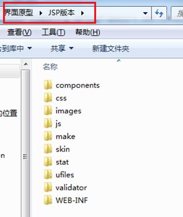
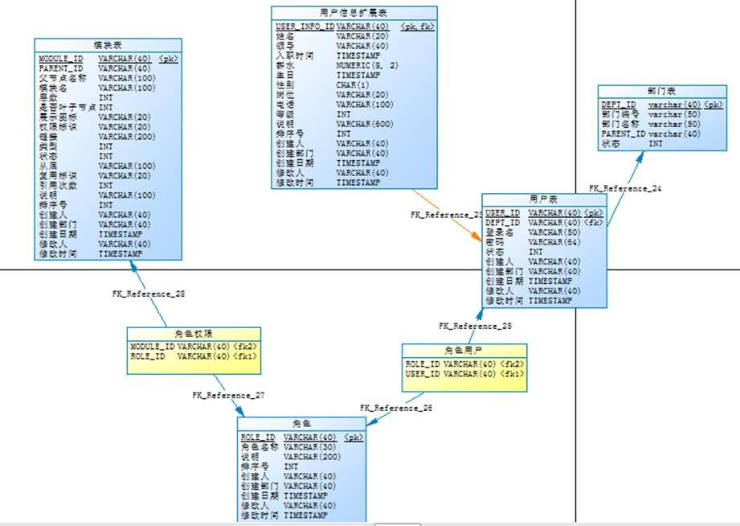
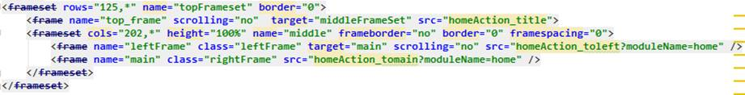
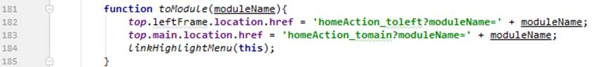

# 1.  用户登录

## 1.1   系统静态页面



## 1.2   pdm



## 1.3   pojo

逆向工程

## 1.4   mapper

逆向工程

## 1.5   service

```java
@Service("userServiceImpl")
public class UserServiceImpl implements UserService {
    @Autowired
    private UserPMapper userPMapper;

    @Override
    public UserP login(String username) {
        UserPExample userPExample = new UserPExample();
        UserPExample.Criteria criteria = userPExample.createCriteria();
        criteria.andUserNameEqualTo(username);
        //必须是启动状态
        criteria.andStateEqualTo(1);
        List<UserP> users = userPMapper.selectByExample(userPExample);
        if(users!=null && users.size()>0){
            return users.get(0);
        }
        return null;
    }
}

```

## 1.6   在web.xml中添加shiroFilter过滤器

```xml
<!--DelegatingFilterProxy：会接授所有的请求，并把这些请求交给spring中id是shiroFilter的bean去处理-->
<filter>
    <filter-name>shiroFilter</filter-name>
    <filter-class>org.springframework.web.filter.DelegatingFilterProxy</filter-class>
    <init-param>
        <param-name>targetFilterLifecycle</param-name>
        <param-value>true</param-value>
    </init-param>
    <init-param>
        <!--设置spring容器filter的bean id,如果不设置会找filter-name -->
        <param-name>targetBeanName</param-name>
        <param-value>shiroFilter</param-value>
    </init-param>
</filter>
<!-- 启动shiro -->
<filter-mapping>
    <filter-name>shiroFilter</filter-name>
    <url-pattern>/*</url-pattern>
</filter-mapping>

```


## 1.7   自定义Realm并实现认证的方法

```java
package cn.yunhe.realm;
import org.apache.shiro.web.filter.authc.FormAuthenticationFilter;
import cn.yunhe.pojo.UserP;
import cn.yunhe.service.UserPService;
import org.apache.shiro.authc.AuthenticationException;
import org.apache.shiro.authc.AuthenticationInfo;
import org.apache.shiro.authc.AuthenticationToken;
import org.apache.shiro.authc.SimpleAuthenticationInfo;
import org.apache.shiro.authz.AuthorizationInfo;
import org.apache.shiro.realm.AuthorizingRealm;
import org.apache.shiro.subject.PrincipalCollection;
import org.apache.shiro.util.ByteSource;
import org.springframework.beans.factory.annotation.Autowired;


public class CustomRealm extends AuthorizingRealm {

    @Autowired
    private UserPService userPService;
    /**
     * 认证
     * @param authenticationToken
     * @return
     * @throws AuthenticationException
     */
    protected AuthenticationInfo doGetAuthenticationInfo(AuthenticationToken authenticationToken) throws AuthenticationException {
        String username = authenticationToken.getPrincipal().toString();//获取身份信息
        UserP userP = userPService.login(username);//根据用户名查找用户信息
        if(userP==null){
            return null;
        }
        String password = userP.getPassword();//获取密码
        String salt = userP.getUserName()+userP.getUserId();//根据用户名和编号作为盐值
        SimpleAuthenticationInfo info = new SimpleAuthenticationInfo(username,password, ByteSource.Util.bytes(salt),this.getName());
        return info;
    }

    /**
     * 授权
     * @param principalCollection
     * @return
     */
    protected AuthorizationInfo doGetAuthorizationInfo(PrincipalCollection principalCollection) {
        return null;
    }


}

```


## 1.8   shiro配置文件

在freight-web工程中添加 Shiro的配置文件

main/resources/ applicationContext-shiro.xml

```xml
<beans xmlns="http://www.springframework.org/schema/beans"
       xmlns:context="http://www.springframework.org/schema/context" xmlns:p="http://www.springframework.org/schema/p"
       xmlns:aop="http://www.springframework.org/schema/aop" xmlns:tx="http://www.springframework.org/schema/tx"
       xmlns:xsi="http://www.w3.org/2001/XMLSchema-instance"
       xsi:schemaLocation="http://www.springframework.org/schema/beans http://www.springframework.org/schema/beans/spring-beans.xsd
   http://www.springframework.org/schema/context http://www.springframework.org/schema/context/spring-context.xsd
   http://www.springframework.org/schema/aop http://www.springframework.org/schema/aop/spring-aop.xsd http://www.springframework.org/schema/tx http://www.springframework.org/schema/tx/spring-tx.xsd ">
  <!--配置凭证匹配器-->
    <bean id="credentialsMatcher" class="org.apache.shiro.authc.credential.HashedCredentialsMatcher">
        <!--算法名称-->
        <property name="hashAlgorithmName" value="md5"></property>
        <!--散列次数-->
        <property name="hashIterations" value="3"/>
    </bean>
    <!--自定义Realm,注入凭证匹配器-->
    <bean id="customRealm" class="cn.yunhe.realm.CustomRealm">
        <property name="credentialsMatcher" ref="credentialsMatcher"/>
    </bean>
    <!--配置安全管理器,注入realm-->
    <bean id="securityManager" class="org.apache.shiro.web.mgt.DefaultWebSecurityManager">
        <property name="realm" ref="customRealm"></property>
    </bean>
    <!--配置FormAuthenticationFilter中的参数名称-->
    <bean id="formAuthenticationFilter" class="org.apache.shiro.web.filter.authc.FormAuthenticationFilter">
        <property name="usernameParam" value="username"></property>
        <property name="passwordParam" value="password"></property>
        <!--认证失败请求的路径-->
        <property name="loginUrl" value="/user/login"/>
    </bean>
    <!--shiroFilter:id必须与web.xml中配置的targetBeanName的值一致；
    如果没有targetBeanName参数名称必须与filter-name的值一致-->
    <bean id="shiroFilter" class="org.apache.shiro.spring.web.ShiroFilterFactoryBean">
        <!--注入安全管理器-->
        <property name="securityManager" ref="securityManager"/>
        <!--认证失跳转的url, 当formAuthenticationFilter中没有配置loginUrl参数时生效，否则不生效-->
        <property name="loginUrl" value="/user/login"/>
        <!--认证成功的url-->
        <property name="successUrl" value="/main"/>
        <!--配自定义的过滤器-->
        <property name="filters">
            <map>
                <entry key="authc" value-ref="formAuthenticationFilter"></entry>
            </map>
        </property>
        <property name="filterChainDefinitions">
            <value>
                <!--登录页匿名访问-->
                /freight = anon
                /index = anon
                <!--静态资源匿名访问-->
                /css/** = anon
                /js/** = anon
                /images/** = anon
                /skin/** = anon
                /components/** = anon
                /favicon.ico = anon
                <!-- 表单认证过滤器 -->
                /user/login = authc
                <!--退出-->
                /logout = logout
            </value>
        </property>
    </bean>
</beans>
```

> 扩展信息
>
> 1. 缓存管理
> 2.  会话管理

###   1.8.1 缓存管理

   shiro每次授权都会通过realm获取权限信息，为了提高访问速度需要添加缓存，第一次从realm中读取权限数据，之后不再读取，这里Shiro和Ehcache整合。

   在main/resources目录下新增缓存配置文件:shiro-ehcache.xml

```xml
<ehcache xmlns:xsi="http://www.w3.org/2001/XMLSchema-instance"
	xsi:noNamespaceSchemaLocation="../config/ehcache.xsd">
	<!--diskStore：缓存数据持久化的目录 地址  -->
	<diskStore path="F:\develop\ehcache" />
	<defaultCache 
		maxElementsInMemory="1000" 
		maxElementsOnDisk="10000000"
		eternal="false" 
		overflowToDisk="false" 
		diskPersistent="false"
		timeToIdleSeconds="120"
		timeToLiveSeconds="120" 
		diskExpiryThreadIntervalSeconds="120"
		memoryStoreEvictionPolicy="LRU">
	</defaultCache>
</ehcache>

```


 在shiro配置文件(applicationContext-shiro.xml)中SecurityManager节点中添加缓存管理

```xml
<!--缓存管理器-->
<bean id="cacheManager" class="org.apache.shiro.cache.ehcache.EhCacheManager">
        <property name="cacheManagerConfigFile"  value="classpath:shiro-ehcache.xml">		</property>
</bean>
<!--配置安全管理器,注入realm-->
<bean id="securityManager" class="org.apache.shiro.web.mgt.DefaultWebSecurityManager">
   <property name="realm" ref="customRealm"></property>
   <!--注入缓存管理器-->
   <property name="cacheManager" ref="cacheManager"/>
</bean>

```

清空缓存

 当用户权限修改后，用户再次登陆shiro会自动调用realm从数据库获取权限数据，如果在修改权限后想立即清除缓存则可以调用realm的clearCache方法清除缓存。

修改CustomRealm： 在CustomRealm中添加clearCached方法。

```java
 //清空缓存:在权限修改后调用realm中的方法，realm已经由spring管理，所以从spring中获取realm实例，调用clearCached方法。
    public void clearCached() {
        //获取身份信息
        PrincipalCollection principals = SecurityUtils.getSubject().getPrincipals();
        //调用父类中清空缓存的方法
        super.clearCache(principals);
    }
```

###   1.8.2 会话管理

在shiro配置文件中添加会话管理器,并注入给安全管理器

```xml
 <!--配置会话管理器-->
    <bean id="sessionManager" class="org.apache.shiro.web.session.mgt.DefaultWebSessionManager">
        <!-- session的失效时长，单位毫秒 -->
        <property name="globalSessionTimeout" value="600000"/>
        <!-- 删除失效的session -->
        <property name="deleteInvalidSessions" value="true"/>
    </bean>
<!--配置安全管理器,注入realm-->
    <bean id="securityManager" class="org.apache.shiro.web.mgt.DefaultWebSecurityManager">
        <property name="realm" ref="customRealm"></property>
        <!--注入缓存管理器-->
        <property name="cacheManager" ref="cacheManager"/>
        <!--注入会话管理器-->
        <property name="sessionManager" ref="sessionManager"/>
    </bean>


```


applicationContext-shiro.xml完全版

```xml
<beans xmlns="http://www.springframework.org/schema/beans"
       xmlns:context="http://www.springframework.org/schema/context" xmlns:p="http://www.springframework.org/schema/p"
       xmlns:aop="http://www.springframework.org/schema/aop" xmlns:tx="http://www.springframework.org/schema/tx"
       xmlns:xsi="http://www.w3.org/2001/XMLSchema-instance"
       xsi:schemaLocation="http://www.springframework.org/schema/beans http://www.springframework.org/schema/beans/spring-beans.xsd
   http://www.springframework.org/schema/context http://www.springframework.org/schema/context/spring-context.xsd
   http://www.springframework.org/schema/aop http://www.springframework.org/schema/aop/spring-aop.xsd http://www.springframework.org/schema/tx http://www.springframework.org/schema/tx/spring-tx.xsd ">
  <!--配置凭证匹配器-->
    <bean id="credentialsMatcher" class="org.apache.shiro.authc.credential.HashedCredentialsMatcher">
        <!--算法名称-->
        <property name="hashAlgorithmName" value="md5"></property>
        <!--散列次数-->
        <property name="hashIterations" value="3"/>
    </bean>
    <!--自定义Realm,注入凭证匹配器-->
    <bean id="customRealm" class="cn.yunhe.realm.CustomRealm">
        <property name="credentialsMatcher" ref="credentialsMatcher"/>
    </bean>
    <!--缓存管理器-->
    <bean id="cacheManager" class="org.apache.shiro.cache.ehcache.EhCacheManager">
        <property name="cacheManagerConfigFile"  value="classpath:shiro-ehcache.xml"></property>
    </bean>
    <!--配置会话管理器-->
    <bean id="sessionManager" class="org.apache.shiro.web.session.mgt.DefaultWebSessionManager">
        <!-- session的失效时长，单位毫秒 -->
        <property name="globalSessionTimeout" value="600000"/>
        <!-- 删除失效的session -->
        <property name="deleteInvalidSessions" value="true"/>
    </bean>
    <!--配置安全管理器,注入realm-->
    <bean id="securityManager" class="org.apache.shiro.web.mgt.DefaultWebSecurityManager">
        <property name="realm" ref="customRealm"></property>
        <!--注入缓存管理器-->
        <property name="cacheManager" ref="cacheManager"/>
        <!--注入会话管理器-->
        <property name="sessionManager" ref="sessionManager"/>
    </bean>

    <!--配置FormAuthenticationFilter中的参数名称-->
    <bean id="formAuthenticationFilter" class="org.apache.shiro.web.filter.authc.FormAuthenticationFilter">
        <property name="usernameParam" value="username"></property>
        <property name="passwordParam" value="password"></property>
        <!--认证失败请求的路径-->
        <property name="loginUrl" value="/user/login"/>
    </bean>
    <!--shiroFilter:id必须与web.xml中配置的targetBeanName的值一致；
    如果没有targetBeanName参数名称必须与filter-name的值一致-->
    <bean id="shiroFilter" class="org.apache.shiro.spring.web.ShiroFilterFactoryBean">
        <!--注入安全管理器-->
        <property name="securityManager" ref="securityManager"/>
        <!--登录的url-->
        <property name="loginUrl" value="/index"/>
        <!--成功的url-->
        <property name="successUrl" value="/main"/>
        <property name="filters">
            <map>
                <entry key="authc" value-ref="formAuthenticationFilter"></entry>
            </map>
        </property>
        <property name="filterChainDefinitions">
            <value>
                <!--登录页匿名访问-->
                /freight = anon
                /index = anon
                <!--静态资源匿名访问-->
                /css/** = anon
                /js/** = anon
                /images/** = anon
                /skin/** = anon
                /components/** = anon
                /favicon.ico = anon
                <!-- 表单认证过滤器 -->
                /user/login = authc
                <!--退出-->
                /logout = logout
            </value>
        </property>
    </bean>

</beans>
```

## 1.9   controller

UserPController

```java
package cn.yunhe.controller;

import cn.yunhe.pojo.UserP;
import cn.yunhe.service.UserPService;
import org.apache.shiro.authc.IncorrectCredentialsException;
import org.apache.shiro.authc.UnknownAccountException;
import org.springframework.beans.factory.annotation.Autowired;
import org.springframework.stereotype.Controller;
import org.springframework.web.bind.annotation.RequestMapping;
import org.springframework.web.bind.annotation.ResponseBody;

import javax.servlet.http.HttpServletRequest;
import java.util.List;

@Controller
@RequestMapping("/user")
public class UserPController {
    @Autowired
    private UserPService userService;

    /**
     * 认证：注意认证成功不调用该方法
     * @return
     */
    @RequestMapping("/login")
    public String login(HttpServletRequest request){
        //1.从request范围中获取错误信息: shiroLoginFailure
        String shiroLoginFailure = (String)request.getAttribute("shiroLoginFailure");
        System.out.println(shiroLoginFailure+"----->");
        //2.判断错误消息的类型
        if(UnknownAccountException.class.getName().equals(shiroLoginFailure)){
            request.setAttribute("errorInfo","账号不正确!");
        }else if(IncorrectCredentialsException.class.getName().equals(shiroLoginFailure)){
            request.setAttribute("errorInfo","密码不正确!");
        }
        return "/index";
    }
}

```

PageController

```java
package cn.yunhe.controller;

import org.springframework.stereotype.Controller;
import org.springframework.web.bind.annotation.RequestMapping;

@Controller
public class PageController {
    //欢迎页
    @RequestMapping("/")
    public String index(){
        return "index"; // /WEB-INF/pages/index.jsp
    }

    //登录
    @RequestMapping("/index")
    public String showLogin(){
        return "index";
    }

    //跳转主页
    @RequestMapping("/main")
    public String main(){
        return "home/fmain";// /WEB-INF/pages/hom/fmain.jsp
    }
}


```

## 1.10   index.jsp

修改登录地址

```jsp
<input class="loginImgOut" value="" type="button"
       onclick="formSubmit('${ctx}/user/login','_self');"
       onmouseover="this.className='loginImgOver'"
       onmouseout="this.className='loginImgOut'"
/>

```

显示异常信息

```jsp
<div class="erro" id="erro">
    <div class="erro_intro">
            ${errorInfo}
    </div>
</div>
```

## 1.11   修改springmvc.xml

添加skin和components的资源映射器

```xml
<mvc:resources location="/skin/" mapping="/skin/**"/>
<mvc:resources location="/components/" mapping="/components/**"/>
```

完整springmvc.xml

```xml
<?xml version="1.0" encoding="UTF-8"?>
<beans xmlns="http://www.springframework.org/schema/beans"
       xmlns:xsi="http://www.w3.org/2001/XMLSchema-instance" xmlns:p="http://www.springframework.org/schema/p"
       xmlns:context="http://www.springframework.org/schema/context"
       xmlns:mvc="http://www.springframework.org/schema/mvc"
       xsi:schemaLocation="http://www.springframework.org/schema/beans http://www.springframework.org/schema/beans/spring-beans.xsd
        http://www.springframework.org/schema/mvc http://www.springframework.org/schema/mvc/spring-mvc.xsd
        http://www.springframework.org/schema/context http://www.springframework.org/schema/context/spring-context.xsd">

    <context:component-scan base-package="cn.yunhe.controller" />
    <mvc:annotation-driven />
    <bean
            class="org.springframework.web.servlet.view.InternalResourceViewResolver">
        <property name="prefix" value="/WEB-INF/pages/" />
        <property name="suffix" value=".jsp" />
    </bean>

    <!--资源映射器-->
    <mvc:resources location="/images/" mapping="/images/**"/>
    <mvc:resources location="/js/" mapping="/js/**"/>
    <mvc:resources location="/css/" mapping="/css/**"/>
    <mvc:resources location="/skin/" mapping="/skin/**"/>
    <mvc:resources location="/components/" mapping="/components/**"/>
    </bean>

</beans>

```


# 2.  主页面

## 2.1   登录成功显示主页面

### 2.1.1   修改applicationContext-shiro.xml

```xml
<!--登录成功的地址-->
<property name="successUrl" value="/main"/>
```

### 2.1.2   修改PageController

```java
//跳转主页
@RequestMapping("/main")
public String main(){
    return "home/fmain";
}
```

## 2.2   主页面布局分析

frameset实现主页面布局：

​           

## 2.3   创建PageController

实现主页面布局显示  

```java
//标题栏菜单
@RequestMapping("/homeAction_totitle")
public String homeAction_totitle(){
    return "home/title";
}

//跳转左侧菜单
@RequestMapping("homeAction_toleft")
public String homeAction_left(String moduleName) throws Exception {
    return moduleName+"/left";
}

//跳转主窗口
@RequestMapping("homeAction_tomain")
public String homeAction_main(String moduleName) throws Exception {
    return moduleName + "/main";
}

```

## 2.4   展示当前登录用户信息

### 2.4.1   创建CurrentUser

 freight-pojo项目中添加CurrentUser封装类(用户信息， 用户的扩展信息及部门信息)

```java
package cn.yunhe.pojo;

import java.io.Serializable;

public class CurrentUser implements Serializable {
    private UserP userP;//封装用户信息
    private UserInfoP userInfoP; //用户扩展信息
    private DeptP deptP; //部门信息

    public UserP getUserP() {
        return userP;
    }

    public void setUserP(UserP userP) {
        this.userP = userP;
    }

    public UserInfoP getUserInfoP() {
        return userInfoP;
    }

    public void setUserInfoP(UserInfoP userInfoP) {
        this.userInfoP = userInfoP;
    }

    public DeptP getDeptP() {
        return deptP;
    }

    public void setDeptP(DeptP deptP) {
        this.deptP = deptP;
    }
}


```

### 2.4.2   修改UserService

```java
@Override
public CurrentUser findUserInfoDeptByUser(UserP user){
    CurrentUser currentUser = new CurrentUser();
    currentUser.setUser(user);// 设置用户基本信息
    currentUser.setDept(deptPMapper.selectByPrimaryKey(user.getDeptId()));// 设置用户所属部门信息
    currentUser.setUserInfo(userInfoPMapper.selectByPrimaryKey(user.getUserId()));// 设置用户详细信息
    return currentUser;
}

```

### 2.4.3   修改realm

```java
package cn.yunhe.realm;
import cn.yunhe.pojo.CurrentUser;
import org.apache.shiro.web.filter.authc.FormAuthenticationFilter;
import cn.yunhe.pojo.UserP;
import cn.yunhe.service.UserPService;
import org.apache.shiro.authc.AuthenticationException;
import org.apache.shiro.authc.AuthenticationInfo;
import org.apache.shiro.authc.AuthenticationToken;
import org.apache.shiro.authc.SimpleAuthenticationInfo;
import org.apache.shiro.authz.AuthorizationInfo;
import org.apache.shiro.realm.AuthorizingRealm;
import org.apache.shiro.subject.PrincipalCollection;
import org.apache.shiro.util.ByteSource;
import org.springframework.beans.factory.annotation.Autowired;


public class CustomRealm extends AuthorizingRealm {

    @Autowired
    private UserPService userPService;
    /**
     * 认证
     * @param authenticationToken
     * @return
     * @throws AuthenticationException
     */
    protected AuthenticationInfo doGetAuthenticationInfo(AuthenticationToken authenticationToken) throws AuthenticationException {
        String username = authenticationToken.getPrincipal().toString();//获取身份信息
        UserP userP = userPService.login(username);//根据用户名查找用户信息
        if(userP==null){
            return null;
        }
        //根据用户信息查询用户扩展信息和部门信息
        CurrentUser currentUser = userPService.findUserInfoDeptByUser(userP);
        String password = userP.getPassword();//获取密码
        String salt = userP.getUserName()+userP.getUserId();//根据用户名和编号作为盐值
        //SimpleAuthenticationInfo info = new SimpleAuthenticationInfo(username,password, ByteSource.Util.bytes(salt),this.getName());

        SimpleAuthenticationInfo info = new SimpleAuthenticationInfo(currentUser,password, ByteSource.Util.bytes(salt),this.getName());

        return info;
    }

    /**
     * 授权
     * @param principalCollection
     * @return
     */
    protected AuthorizationInfo doGetAuthorizationInfo(PrincipalCollection principalCollection) {
        return null;
    }

}


```

### 2.4.4   修改PageController

```java
//跳转标题栏菜单
@RequestMapping("/homeAction_totitle")
public String homeAction_totitle(Model model){
    Subject subject = SecurityUtils.getSubject();
    CurrentUser currentUser = (CurrentUser) subject.getPrincipal();
    model.addAttribute("currentUser",currentUser);
    return "home/title";
}
```

### 2.4.5   修改title.jsp

```jsp
<div id="userInfo" style="z-index:999;" onclick="HideLoginDiv()" title="点击关闭">
		
		您好：<strong>${currentUser.userInfoP.name}</strong>&nbsp;&nbsp;|
		您所属单位：
		<c:if test="${!empty currentUser.deptP}">
		<strong>${currentUser.deptP.deptName}</strong>&nbsp;&nbsp;
	</c:if>
```

## 2.5   退出

### 2.5.1   修改applicationContext-shiro.xml

```xml
<!--退出-->
/logout = logout
```


# 3.  顶部菜单授权

## 3.1   mapper

 

### 3.1.1   修改ModulePMapper.xml

```xml
<!--查询用户权限-->
<select id="getPermissionsByUserId" parameterType="String" resultMap="BaseResultMap">
 select m.* from module_p m inner join role_module_p p2 on m.MODULE_ID = p2.MODULE_ID
    inner join role_p rp on p2.ROLE_ID = rp.ROLE_ID
    inner join role_user_p rup on rp.ROLE_ID = rup.ROLE_ID
    inner join user_p u on rup.USER_ID = u.USER_ID
    where u.USER_ID  = #{userid}
</select>

```

或

```xml
<select id="getPermissionsByUserId" parameterType="String" resultMap="BaseResultMap">
  select * from module_p where module_id in(
    select module_id from role_module_p where role_id in (
        select role_id from role_user_p where user_id=#{userid}
    )
  )
</select>
```

### 3.1.2   修改ModulePMapper

```java
List<ModuleP> getPermissionsByUserId(String userid);
```

## 3.2   修改UserServiceImpl

```java
@Override
public List<ModuleP> getPermissionsByUserId(String userid){
    return modulePMapper.getPermissionsByUserId(userid);
}
```

## 3.3   修改realm

```java
//授权
@Override
protected AuthorizationInfo doGetAuthorizationInfo(PrincipalCollection principal) {
    // 获取用户
    CurrentUser currentUser = (CurrentUser) principal.getPrimaryPrincipal();
    UserP user = currentUser.getUser();

    SimpleAuthorizationInfo authorizationInfo = new SimpleAuthorizationInfo();

        // 填充用户权限
        List<ModuleP> modulePList = userService.getPermissionsByUserId(user.getUserId());
        if (modulePList != null && modulePList.size() > 0) {
            for (ModuleP m : modulePList) {
                authorizationInfo.addStringPermission(m.getCpermission());
            }
        }

        return authorizationInfo;
}
```

## 3.4   修改title.jsp

```jsp
<!-- 当jsp页面碰到shiro标签时就执行Realm中的授权方法 -->
<shiro:hasPermission name="系统首页">
    <span id="topmenu" onclick="toModule('home');">系统首页</span><span id="tm_separator"></span>
</shiro:hasPermission>
<shiro:hasPermission name="货运管理">
    <span id="topmenu" onclick="toModule('cargo');">货运管理</span><span id="tm_separator"></span>
</shiro:hasPermission>
<shiro:hasPermission name="统计分析">
    <span id="topmenu" onclick="toModule('stat');">统计分析</span><span id="tm_separator"></span>
</shiro:hasPermission>
<shiro:hasPermission name="基础信息">
    <span id="topmenu" onclick="toModule('baseinfo');">基础信息</span><span id="tm_separator"></span>
</shiro:hasPermission>
<shiro:hasPermission name="系统管理">
    <span id="topmenu" onclick="toModule('sysadmin');">系统管理</span>
</shiro:hasPermission>
<shiro:hasPermission name="流程管理">
     <span id="topmenu" onclick="toModule('activiti');">流程管理</span>
</shiro:hasPermission>
<shiro:hasPermission name="请假管理">
     <span id="topmenu" onclick="toModule('leave');">请假管理</span>
</shiro:hasPermission>

```

## 3.5   顶部菜单点击效果

为什么顶部菜单点击后，左侧和中间区域页面发生改变？  

title.jsp

​            

​         

PageController

```java
//跳转左侧菜单
@RequestMapping("homeAction_toleft")
public String homeAction_left(String moduleName, Model model){
    model.addAttribute("moduleName", moduleName);
    return moduleName + "/left";
}

//跳转主窗口
@RequestMapping("homeAction_tomain")
public String homeAction_main(String moduleName, Model model){
    model.addAttribute("moduleName", moduleName);
    return moduleName + "/main";
}


```

