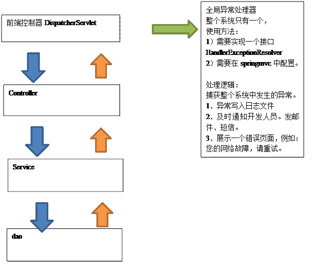
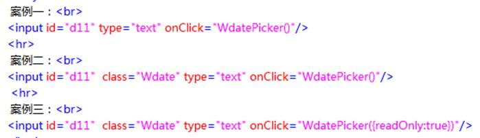

# 1.  全局异常处理器

## 1.1   处理思路

 

|      |                                        |
| ---- | -------------------------------------- |
|      |  |

 

## 1.2   创建全局异常处理器

```java
package cn.yunhe.exception;

import org.slf4j.Logger;
import org.slf4j.LoggerFactory;
import org.springframework.web.servlet.HandlerExceptionResolver;
import org.springframework.web.servlet.ModelAndView;

import javax.servlet.http.HttpServletRequest;
import javax.servlet.http.HttpServletResponse;

public class GlobalExceptionReslover implements HandlerExceptionResolver {
    private Logger logger = LoggerFactory.getLogger(GlobalExceptionReslover.class);

    public ModelAndView resolveException(HttpServletRequest httpServletRequest, HttpServletResponse httpServletResponse, Object o, Exception e) {
        //写入日志文件
        logger.error("系统发生异常",e);
        //发送邮件，发短信
        ModelAndView mv = new ModelAndView();
        mv.addObject("message","系统发生异常,请联系管理员");
        mv.addObject("stack",e);
        mv.setViewName("error");
        return mv;
    }
}

```

 

## 1.3   配置异常处理器

修改springmvc.xml

```xml
 <!--全局异常处理器-->
 <bean id="handlerExceptionResolver" class="cn.yunhe.exception.GlobalExceptionReslover"/>
```

## 1.4   错误页面

参考pages/error.jsp

# 2.  系统管理子菜单授权

修改pages/sysadmin/left.jsp

```jsp
<ul>
    <shiro:hasPermission name="部门管理">
	  <li><a href="${ctx}/dept/list" onclick="linkHighlighted(this)" target="main" 		id="aa_1">部门管理</a></li>
    </shiro:hasPermission>
    <shiro:hasPermission name="用户管理">
		<li><a href="${ctx}/user/list" onclick="linkHighlighted(this)" target="main" id="aa_1">用户管理</a></li>
    </shiro:hasPermission>
    <shiro:hasPermission name="角色管理">
		<li><a href="${ctx}/role/list" onclick="linkHighlighted(this)" target="main" id="aa_1">角色管理</a></li>
     </shiro:hasPermission>
     <shiro:hasPermission name="模块管理">
		<li><a href="${ctx}/module/list" onclick="linkHighlighted(this)" target="main" id="aa_1">模块管理</a></li>
    </shiro:hasPermission>
</ul>
```


# 3.  部门管理

## 3.1   查询

### 3.1.1   pojo


```java
public class DeptPVo {
    private String deptId;

    private String deptName;

    private String parentId;

    private Integer state;

    private String deptNo;

    private String parentName;
    ... ...
}

```


 

### 3.1.2   mapper

#### 3.1.2.1  mapper.xml

添加一个查询所有部门信息及上级部门名称的功能

```xml

 
  <resultMap id="DeptAndParentBaseResultMap" type="cn.yunhe.pojo.DeptPVo" >
    <id column="DEPT_ID" property="deptId" jdbcType="VARCHAR" />
    <result column="DEPT_NAME" property="deptName" jdbcType="VARCHAR" />
    <result column="PARENT_ID" property="parentId" jdbcType="VARCHAR" />
    <result column="STATE" property="state" jdbcType="INTEGER" />
    <result column="dept_no" property="deptNo" jdbcType="VARCHAR" />
    <result column="parent_name" property="parentName"></result>
  </resultMap>

  <select id="listDeptAndParent" resultMap="DeptAndParentBaseResultMap">
    select d.*,p.DEPT_NAME parentName from dept_p d,dept_p p where d.PARENT_ID=p.dept_id
  </select>
```

MyBatis的分页插件PageHelper: https://pagehelper.github.io/

​	 1.添加依赖

```xml
<dependency>
            <groupId>com.github.pagehelper</groupId>
            <artifactId>pagehelper</artifactId>
</dependency>
```

2. 在MyBatis配置文件中配置插件SqlMapConfig.xml

```xml
<?xml version="1.0" encoding="UTF-8" ?>
<!DOCTYPE configuration
        PUBLIC "-//mybatis.org//DTD Config 3.0//EN"
        "http://mybatis.org/dtd/mybatis-3-config.dtd">
<configuration>

    <settings>
        <!--延迟加载开关  -->
        <setting name="lazyLoadingEnabled" value="true"/>
        <setting name="aggressiveLazyLoading" value="false"/>
    </settings>
    <!--类型别名  -->
    <typeAliases>
    </typeAliases>
    <!--分页插件-->
    <plugins>
        <plugin interceptor="com.github.pagehelper.PageHelper">
            <property name="dialect" value="mysql"/>
        </plugin>
    </plugins>
</configuration>`
```


新建PageBean(freight-common)

```java
package cn.yunhe.pojo;

import java.util.List;

public class PageBean {
    //数据
    private List<?> datas;

    //总共多少条
    private Long totalRows;

    //当前页
    private Integer curPage=1;

    //每页多少条数据
    private Integer pageSize=10;

    //总共多少页
    private Integer totalPages;

    public List<?> getDatas() {
        return datas;
    }

    public void setDatas(List<?> datas) {
        this.datas = datas;
    }

    public Long getTotalRows() {
        return totalRows;
    }

    public void setTotalRows(Long totalRows) {
        this.totalRows = totalRows;
    }

    public Integer getCurPage() {
        return curPage;
    }

    public void setCurPage(Integer curPage) {
        this.curPage = curPage;
    }

    public Integer getPageSize() {
        return pageSize;
    }

    public void setPageSize(Integer pageSize) {
        this.pageSize = pageSize;
    }

    public Integer getTotalPages() {
        return totalPages;
    }

    public void setTotalPages(Integer totalPages) {
        this.totalPages = totalPages;
    }
}

```

 

#### 3.1.2.2  mapper

```
List listDeptAndParent();
```

### 3.1.3   pom

修改freight-service的pom.xml

```xml
        <dependency>
            <groupId>cn.yunhe</groupId>
            <artifactId>freight-common</artifactId>
            <version>1.0-SNAPSHOT</version>
        </dependency>`
```

 

### 3.1.4   service

```java
package cn.yunhe.service;

import cn.yunhe.pojo.PageBean;

public interface DeptService {

    public PageBean listDeptOfPage(PageBean pageBean);
}


```


```java

@Service
public class DeptServiceImpl implements DeptService {
    @Autowired
    private DeptPMapper deptPMapper;

    public PageBean listDeptOfPage(PageBean pageBean) {
         //设置当前页和分页单位(必须放置查询数据之前)
        PageHelper.startPage(pageBean.getCurPage(),pageBean.getPageSize());
        //查询部门信息
        List<DeptPVo> list = deptPMapper.listDeptAndParent();
        //创建PageInfo对象,是PageHelper提供的工具类
        PageInfo<DeptPVo> pageInfo = new PageInfo<DeptPVo>(list);
        //获取分页的数据
        List<DeptPVo> data = pageInfo.getList();
        //获取总记录数
        long totalRows = pageInfo.getTotal();
        //获取总页数
        int totalPages = pageInfo.getPages();
        //将数据封装到PageBean中
        pageBean.setDatas(data);
        pageBean.setTotalRows(totalRows);
        pageBean.setTotalPages(totalPages);
        return pageBean;
    }
}

```

 

### 3.1.5   controller

```java
@Controller
@RequestMapping("/dept")
public class DeptPController {
    @Autowired
    private DeptPService deptPService;

    @RequestMapping("/list")
    public String listDeptAndParent(Model model, PageBean pageBean){
        PageBean pb = deptPService.listDeptOfPage(pageBean);
        model.addAttribute("pb", pb);
        return "sysadmin/dept/jDeptList";
    }

}
```

 

### 3.1.6   jsp

参考：

WEB-INF/pages/sysadmin/dept/jDeptList.jsp

```jsp
<script type="text/javascript" src="${ctx }/js/jquery.min.js"></script>
...
<c:forEach items="${pb.datas}" var="dept"  varStatus="st">
		<tr class="odd" onmouseover="this.className='highlight'" onmouseout="this.className='odd'" >
			<td><input type="checkbox" name="id" value="${dept.deptId }"/></td>
			<td>${st.count }</td>
			<td>${dept.deptNo }</td>
			<td>${dept.parentName }</td>
			<td><a href="deptAction_toview?id=${dept.deptId }">${dept.deptName }</a></td>
			<td>${dept.state==1?'启用':'停用'}</td>
		</tr>
</c:forEach>

```

 

pages/page.jsp

```jsp
<script>
    function changePage(curPage){
        var ps = document.getElementById("ps").value;
        location.href="/dept/list?curPage="+curPage+"&pageSize="+ps;
    }
    function changeSize(){
        var cp = document.getElementById("cp").value;
        var ps = document.getElementById("ps").value;
        location.href="/dept/list?curPage="+cp+"&pageSize="+ps;
    }
</script>
```

 

## 3.2   新增

修改Service

```java

public interface DeptService {
    public PageBean listDeptOfPage(PageBean pageBean)throws Exception;
    public List<DeptP> listDept()throws Exception;
    public void createDept(DeptP deptP)throws Exception;
}
```


```java
@Service
public class DeptServiceImpl implements DeptService{

    @Autowired
    private DeptMapper deptMapper;

    @Override
    public PageBean listDeptOfPage(PageBean pageBean) throws Exception {
         //设置当前页和分页单位(必须放置查询数据之前)
        PageHelper.startPage(pageBean.getCurPage(),pageBean.getPageSize());
        //查询部门信息
        List<DeptPVo> list = deptPMapper.listDeptAndParent();
        //创建PageInfo对象,是PageHelper提供的工具类
        PageInfo<DeptPVo> pageInfo = new PageInfo<DeptPVo>(list);
        //获取分页的数据
        List<DeptPVo> data = pageInfo.getList();
        //获取总记录数
        long totalRows = pageInfo.getTotal();
        //获取总页数
        int totalPages = pageInfo.getPages();
        //将数据封装到PageBean中
        pageBean.setDatas(data);
        pageBean.setTotalRows(totalRows);
        pageBean.setTotalPages(totalPages);
        return pageBean;
        return pageBean;
    }

    @Override
    public List<DeptP> listDept() throws Exception {
        return deptMapper.selectByExample(null);
    }

    @Override
    public void createDept(DeptP deptP) throws Exception {
        deptP.setDeptId(UUID.randomUUID().toString());
        deptP.setState(1);
        deptP.setDeptNo(String.valueOf(System.currentTimeMillis()));
        deptPMapper.insertSelective(deptP);
    }

}

```


修改Controller

```java
@Controller
@RequestMapping("/dept")
public class DeptPController {
    @Autowired
    private DeptService deptService;

    @RequestMapping("/list")
    public String listDeptAndParent(Model model, PageBean pageBean){
        PageBean pb = deptPService.listDeptOfPage(pageBean);
        model.addAttribute("pb", pb);
        return "sysadmin/dept/jDeptList";
    }

    @RequestMapping("tocreate")
    public String tocreate(PageBean pageBean,Model model) throws Exception {
        List<DeptP> depts = deptPService.listDept();
        model.addAttribute("depts",depts);
        return "sysadmin/dept/jDeptCreate";
    }

    @RequestMapping("create")
    public String createDept(DeptP deptP) throws Exception {
        deptPService.createDept(deptP);
        return "redirect:/dept/list";
    }
}

```

修改页面:sysadmin/dept/jDeptList.jsp

```jsp
<li id="new"><a href="#" onclick="formSubmit('/dept/tocreate','_self');this.blur();">新增</a></li>

```

修改页面:sysadmin/dept/jDeptCreate.jsp

```jsp
<li id="save"><a href="#" onclick="formSubmit('/dept/create','_self');this.blur();">保存</a></li>
....
<c:if test="${!empty depts}">
	<select name="pid">
		<option value="">--请选择--</option>
		<c:forEach items="${depts}" var="d">
				<option value="${d.deptId}">${d.deptName}</option>
			</c:forEach>
	</select>
</c:if>
```


## 3.3   修改

### 3.3.1   jDeptList.jsp

```js
function isOnlyChecked(){
    if($("input[name='id']:checked").length==1){
        return true; 
    } 
    return false; 
}`     
```

### 3.3.2   jDeptUpdate.jsp

```jsp
`<script type="text/javascript"> 
    //上级部门回显  
    $(function(){ 
        $("#parentId").val(${dept.parentId}); 
    });
    ....
</script> 
```

 

## 3.4   查看

作业

## 3.5   删除

作业

# 4.  excel导出

## 4.1   什么是poi

Apache POI是Apache软件基金会的开放源码函式库，POI提供API给Java程序对Microsoft Office格式档案读和写的功能。

## 4.2   poi的依赖

```xml
<!--poi-->
<dependency>
    <groupId>org.apache.poi</groupId>
    <artifactId>poi</artifactId>
    <version>3.10-FINAL</version>
</dependency>
<dependency>
    <groupId>org.apache.poi</groupId>
    <artifactId>poi-ooxml</artifactId>
    <version>3.10-FINAL</version>
</dependency>

```

## 4.3   创建poi工具类

参考：


## 4.4   创建excel导出模板


## 4.5   修改page.jsp

```js
  function exportExcel(){
        var cp = document.getElementById("cp").value;
        var ps = document.getElementById("ps").value;
        location.href="/dept/export?curPage="+cp+"&pageSize="+ps;
  }
... ...

 <a href="javascript:exportExcel()"></a></td>

```

 

## 4.6   导出excel

修改DeptController

```java
@RequestMapping("export")
public void export(PageBean pageBean, HttpServletRequest request, HttpServletResponse response) throws Exception {
    //查询要导出的数据
    PageBean pb = deptService.listDeptOfPage(pageBean);
    List<DeptPVo> datas = (List<DeptPVo>) pb.getDatas();

    //把数据填充到excel里
    //1、获取excel导出模板
    ExportExcelUtil excelUtil = new ExportExcelUtil();
    String realPath = request.getSession().getServletContext().getRealPath("/");
    String filePath = "/tpl/dept_export.xlsx";
    File excelTplFile = excelUtil.getExcelTplFile(realPath, filePath);
    //工作簿
    Workbook workbook = excelUtil.getWorkbook(excelTplFile);
    //工作表(sheet)
    Sheet sheet = excelUtil.getSheet(workbook,"部门信息");
    for (int i = 0; i < datas.size(); i++) {
        DeptPVo deptPVo =  datas.get(i);
        //行
        Row row = excelUtil.createRow(sheet);
        Cell cell0 = excelUtil.createCell(row,0);
        cell0.setCellValue(deptPVo.getDeptNo());

        Cell cell1 = excelUtil.createCell(row,1);
        cell1.setCellValue(deptPVo.getParentName());

        Cell cell2 = excelUtil.createCell(row,2);
        cell2.setCellValue(deptPVo.getDeptName());

        Cell cell3 = excelUtil.createCell(row,3);
        cell3.setCellValue(deptPVo.getState()==1?"启用":"停用");
    }

    //把写好的excel发送到客户端
    String fileName="dept_list.xlsx";
    response.setContentType("application/ms-excel");
    response.setHeader("Content-disposition", "attachment;filename="+fileName);
    ServletOutputStream ouputStream = response.getOutputStream();
    workbook.write(ouputStream);
    ouputStream.flush();
    ouputStream.close();

}
   
```

#  5.  用户管理

## 5.1   查询

### 5.1.1   mapper

逆向工程

### 5.1.2   service

```java
@Override
public PageBean listUserOfPage(PageBean pageBean) throws Exception {
    //设置查询条件
    PageHelper.startPage(pageBean.getCurPage(),pageBean.getPageSize());

   //排序
   UserPExample userPExample = new UserPExample();
   userPExample.setOrderByClause("update_time desc");
   List<UserP> userPList = userPMapper.selectByExample(userPExample);


    //获取分页信息
    PageInfo<UserP> pageInfo = new PageInfo<UserP>(userPList);

    pageBean.setTotalPages(pageInfo.getPages());
    pageBean.setDatas(pageInfo.getList());
    pageBean.setTotalRows(pageInfo.getTotal());
    return pageBean;
}

```

### 1.1.3   controller

```java
/**
 * 分页查询用户信息
 * @param pageBean
 * @param model
 * @return
 * @throws Exception
 */
@RequestMapping("list")
public String listUserOfPage(PageBean pageBean, Model model) throws Exception {
    PageBean pb = userService.listUserOfPage(pageBean);
    model.addAttribute("pb",pb);
    return "sysadmin/user/jUserList";
}

```

 

## 5.2   新增

### 5.2.1   新增跳转

#### 5.2.1.1  mapper

逆向工程

#### 5.2.1.2  service

```java

public interface UserinfoService {
    /**
     * 查询用户扩展信息列表
     * @return
     * @throws Exception
     */
    public List<UserInfoP> listUserinfo() throws Exception;
}
```

```java
@Service
public class UserinfoServiceImpl implements UserinfoService {
    @Autowired
    private UserInfoPMapper userInfoPMapper;

    public List<UserInfoP> listUserinfo() throws Exception {
        return userInfoPMapper.selectByExample(null);
    }
}

```

#### 5.2.1.3  Controller

```java
@Controller
@RequestMapping("/user")
public class UserPController {
    @Autowired
    private UserPService userService;
    @Autowired
    private DeptService deptService;
    @Autowired
    private UserinfoService userinfoService;
  /**
     * 跳转新增页面
     * @param model
     * @return
     */
    @RequestMapping("/tocreate")
    public String tocreate(Model model) throws Exception {
        //查询部门列表
        List<DeptP> ds = deptService.listDept();
        model.addAttribute("ds",ds);
        //查询用户扩展信息列表
        List<UserInfoP> uis = userinfoService.listUserinfo();
        model.addAttribute("uis",uis);
        return "sysadmin/user/jUserCreate";
    }
}
```

5.2.1.4  jsp

参考sysadmin/user/jUserCreate.jsp页面

#### 5.2.2.1  mapper

逆向工程

#### 5.2.2.2  service

```java

    public void createUser(CurrentUser currentUser,UserP user, UserInfoP userinfoP) {
        UserP loginUser = currentUser.getUserP();//获取当前登录的用户信息
        DeptP loginDept = currentUser.getDeptP();//获取登录用户的部门信息
        //补全用户信息
        user.setCreateBy(loginUser.getUserId());//创建人
        user.setCreateDept(loginDept.getDeptId());//创建部门
        user.setUpdateBy(loginUser.getUserId());//更新人
        user.setCreateTime(new Date());//创建时间
        user.setUpdateTime(new Date());//更新时间
        //补全用户扩展信息
        userinfoP.setCreateBy(loginUser.getUserId());//创建人
        userinfoP.setCreateDept(loginDept.getDeptId());//创建部门
        userinfoP.setUpdateBy(loginUser.getUserId());//更新人
        userinfoP.setCreateTime(new Date());//创建时间
        userinfoP.setUpdateTime(new Date());//更新时间
        //新增用户
        userPMapper.insertSelective(user);
        //新增用户扩展信息
        userInfoPMapper.insertSelective(userinfoP);
    }
```

 

#### 5.2.2.3  controller

```java
   /**
     * 用户新增
     * @return
     * @throws Exception
     */
    @RequestMapping("/create")
    public String create(UserP userP,UserInfoP userInfoP) throws Exception {
        //获取认证的用户信息
        Subject subject = SecurityUtils.getSubject();
        CurrentUser currentUser = (CurrentUser)subject.getPrincipal();
        //补全用户信息
        String userId = UUID.randomUUID().toString();//userId
        userP.setUserId(userId);
        String salt = userP.getUserName()+userId;
        //对初始密码111进行加密
        String password = new Md5Hash("111",salt,3).toString();
        userP.setPassword(password);
        //设置userinfoP的用户编号
        userInfoP.setUserInfoId(userId);
        userService.createUser(currentUser,userP,userInfoP);
        return "redirect:/user/list";
    }
   
```

#### 5.2.2.4  jsp

参考UserCreate.jsp

#### 5.2.2.5  My97Date

##### 5.2.2.5.1 下载

http://www.my97.net/down.asp

##### 5.2.2.5.2 引用

1、在使用该日期控件的文件中加入JS库(仅这一个文件即可,其他文件会自动引入,请勿删除或改名)

2、引用代码如下： 

```jsp
<script language="javascript" type="text/javascript" src="datepicker/WdatePicker.js"></script>
```


3、注:src="datepicker/WdatePicker.js" 请根据你的实际情况改变路径

##### 5.2.2.5.3 示例



#### 5.2.2.6  日期转换器

5.2.2.6.1  在web项目中添加commons-lang3的依赖

```xml
 <!--commons-lang3-->
        <dependency>
            <groupId>org.apache.commons</groupId>
            <artifactId>commons-lang3</artifactId>
        </dependency>
```

##### 5.2.2.6.2 创建日期转换器

```java
public class DateConverter implements Converter<String, Date> {

   public Date convert(String str) {
      String[] patterns = new String[]{
            "yyyy-MM-dd","yyyy-MM-dd hh:mm:ss","yyyy/mm/dd","yyyy/MM/dd hh:mm:ss",
            "MM-dd-yyyy","dd-MM-yyyy"};
      Date d = null;
      try {
         d=DateUtils.parseDate(str, patterns);
      } catch (ParseException e) {
         e.printStackTrace();
      }
      return d;
   }

}
   
```

 

##### 5.2.2.6.3 配置日期转换器

修改springmvc.xml

```xml
<mvc:annotation-driven conversion-service="cs"/>
... ...
<!-- 日期转换器 -->
<bean id="cs" class="org.springframework.format.support.FormattingConversionServiceFactoryBean">
    <property name="converters">
        <set>
            <bean class="cn.yunhe.converter.DateConverter"></bean>
        </set>
    </property>
</bean>

```

 

## 5.3   修改

作业

## 5.4    查看

作业

## 5.5   删除

作业

## 5.6   excel导出

作业