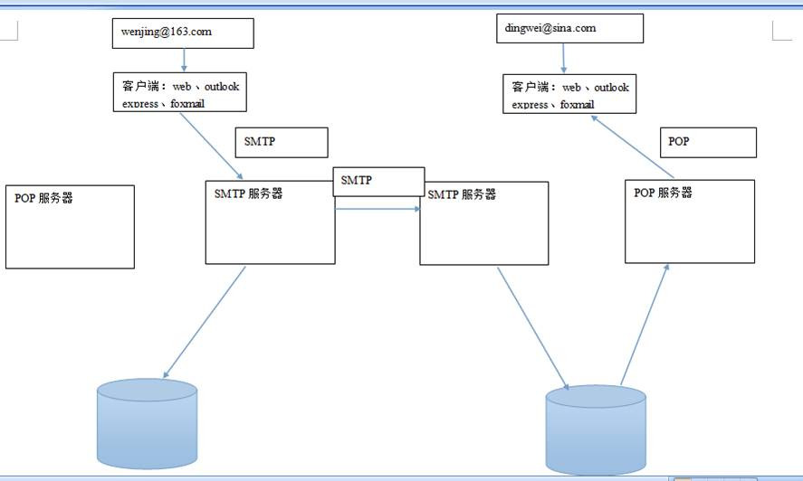
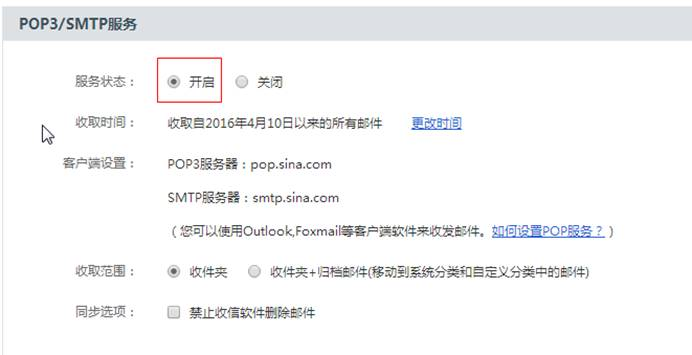
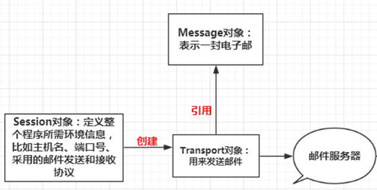
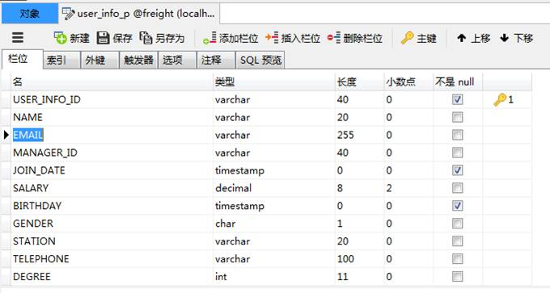
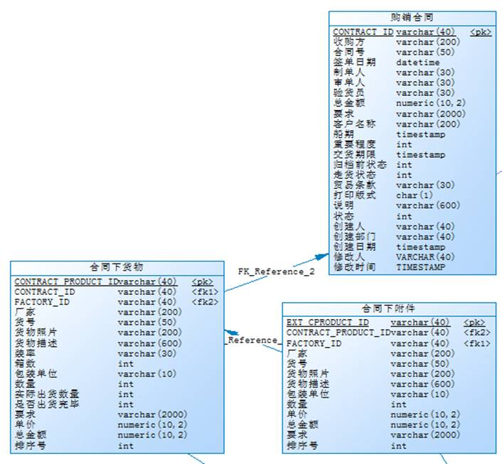
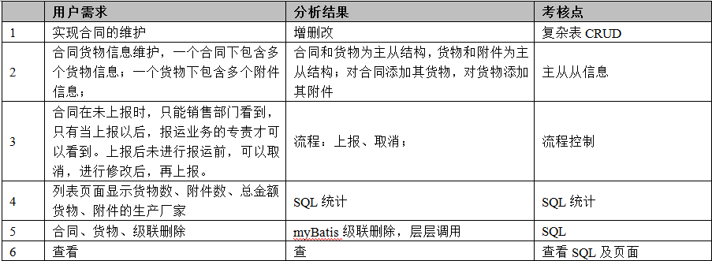

# 1.  什么是JavaMail

  JavaMail是提供给开发人员在应用程序中实现邮件发送和接收功能而提供的一套标准开发类库，支持常用的邮件协议，如SMTP、POP3、IMAP，开发人员使用JavaMail编写邮件程序时，无需考虑底层的通信细节(Socket)，JavaMail也提供了能够创建出各种复杂MIME格式的邮件内容的API。使用JavaMail，我们可以实现类似OutLook、FoxMail的软件。

# 2.  JavaMail的基本概述

## 2.1   邮件开发的相关协议

Ø **SMTP** 的全称是“Simple Mail Transfer Protocol”，即简单邮件**传输**协议（25号端口）。

Ø **POP3**是Post Office Protocol 3的简称，即邮局协议的第3个版本，是TCP/IP协议族中的一员（默认端口是110）。

Ø **IMAP**全称是Internet Mail Access Protocol，即交互式邮件存取协议，它是跟POP3类似邮件访问标准协议之一

 

## 2.2   IMAP和POP3有什么区别?

**[POP3](http://help.163.com/09/1223/14/5R7P6CJ600753VB8.html?servCode=6010376)**协议允许电子邮件客户端下载服务器上的邮件，但是在客户端的操作（如移动邮件、删除邮件、标记已读等），不会反馈到服务器上，比如通过客户端收取了邮箱中的3封邮件并移动到其他文件夹，邮箱服务器上的这些邮件是没有同时被移动的 。

**[IMAP](http://help.163.com/09/1223/14/5R7P6CJ600753VB8.html?servCode=6010376)**提供webmail 与电子邮件客户端之间的双向通信，客户端的操作都会反馈到服务器上，对邮件进行的操作，服务器上的邮件也会做相应的动作。

 

## 2.3   POP3/IMAP、SMTP之间的区别和联系

简单地说，SMTP管“发”，POP3/IMAP管“收”。

举个例子，你坐在电脑边用mail client写完邮件，点击‘发送’。这时你的mail client会发消息给邮件服务器上的SMTP service。这时有两种情况：

1. 如果邮件的收信人也是处于同一个domain，比如从http://163.com发送给163的邮箱，SMTP service只需要转给local的POP3 Service即可

2. 如果邮件收信人是另外的domain，比如http://163.com发送给http://sina.com， SMTP service需要通过询问DNS,找到属于sina的SMTP service的host

其实一般每个提供电子邮件服务的网站都有自己的SMTP和POP服务器地址，在你登录你的电子邮件网站时仔细找找肯定能发现它们，如果找不到还可以查看一下网站的“帮助”。

## 2.4   邮件发送的过程



# 3.  JavaMail的准备工作

## 3.1   申请邮箱


进入后开通POP3/SMTP服务



## 3.2   引入JavaMail 依赖


```xml
<!-- Javamail -->
<dependency>
    <groupId>javax.mail</groupId>
    <artifactId>mail</artifactId>
    <version>1.4.4</version>
</dependency>
`
```

 

## 3.3   测试


```java
import org.junit.Test;
import javax.mail.Address;
import javax.mail.Session;
import javax.mail.Transport;
import javax.mail.internet.InternetAddress;
import javax.mail.internet.MimeMessage;
import java.util.Properties;

public class JavaMailTest {
    @Test
    public void test() throws Exception {
        //设置发送者的配置信息
        Properties properties = new Properties();
        //发送者的协议
        properties.put("mail.smtp.host","smtp.126.com");
        properties.put("mail.smtp.auth","true");
        Session session = Session.getInstance(properties);
        //设置调试信息在控制台打印出来
        session.setDebug(true);

        //信息体
        MimeMessage message = new MimeMessage(session);

        //发信者
        Address address = new InternetAddress("guangweima@126.com");
        message.setFrom(address);
        //收信者
        Address toAddress = new InternetAddress("361499689@qq.com");

        /**
         * 设置收件人地址（可以增加多个收件人、抄送、密送）
         * MimeMessage.RecipientType.TO:发送
         * MimeMessage.RecipientType.CC：抄送
         * MimeMessage.RecipientType.BCC：密送
         */
        message.setRecipient(MimeMessage.RecipientType.TO,toAddress);

        //主题
        message.setSubject("米西米西");
        //正文
        message.setText("哈喽啊，饭已ok啦，下来米西吧！！！");
        message.saveChanges();

        //发送邮件
        Transport transport = session.getTransport("smtp");
        //登录
        transport.connect("guangweima@126.com", "361499beyond");
        transport.sendMessage(message, message.getAllRecipients());
        transport.close();
    }
}
 `
```

## 3.4   JavaMail的三个核心类



## 3.5   测试二


```java
import org.junit.Test;

import javax.mail.Address;
import javax.mail.Session;
import javax.mail.Transport;
import javax.mail.internet.InternetAddress;
import javax.mail.internet.MimeMessage;
import java.util.Properties;

public class JavaMailTest {
    //发件人地址
    public static String senderAddress = "guangweima@126.com";
    //收件人地址
    public static String recipientAddress = "361499689@qq.com";
    //发件人账户名
    public static String senderAccount = "guangweima@126.com";
    //发件人账户密码
    public static String senderPassword = "xxxxxxxxx";
    @Test
    public void test2() throws Exception {
        /**********session对象**********/
        Properties properties = new Properties();
        properties.put("mail.smtp.host","smtp.126.com");
        properties.put("mail.smtp.auth","true");
        Session session = Session.getInstance(properties);
        session.setDebug(true);


        /**************message对象*************/
        MimeMessage message = getMessage(session);


        /**************transport对象*************/
        Transport transport = session.getTransport("smtp");
        transport.connect(senderAccount, senderPassword);
        transport.sendMessage(message, message.getAllRecipients());
        transport.close();
    }
   /**
     * 获得message对象
     * @param session
     * @return
     * @throws Exception
     */
    public MimeMessage getMessage(Session session) throws Exception {
        MimeMessage message = new MimeMessage(session);

        InternetAddress address = new InternetAddress(senderAddress);
        message.setFrom(address);

        InternetAddress toAddress = new InternetAddress(recipientAddress);
        message.setRecipient(MimeMessage.RecipientType.TO,toAddress);

        message.setSubject("哈哈");
        message.setText("下了课我们去洗脚吧","UTF-8");
        message.saveChanges();

        return  message;
    }
}

```

 


# 4.  Spring整合javaMail

Spring邮件抽象层的主要包为org.springframework.mail。它包括了发送电子邮件的主要接口**MailSender**，和*其对象***SimpleMailMessage**，它封装了简单邮件的属性如*from*, *to*,*cc*, *subject*,*text*。 包里还包含一棵以MailException为根的checked Exception继承树，它们提供了对底层邮件系统异常的高级别抽象。

 

为了使用JavaMail中的一些特色, 比如MIME类型的信件：

[spring](http://lib.csdn.net/base/17)提供了MailSender的一个子接口, 即org.springframework.mail.javamail.JavaMailSender。

[spring](http://lib.csdn.net/base/17)还提供了一个回调接口org.springframework.mail.javamail.MimeMessagePreparator, 用于准备JavaMail的MIME信件。

 

这里简单的介绍了如何使用spring发送各种形式的邮件以及配置：

## 4.1   mail.properties


```properties
mail.host=smtp.126.com
mail.username=你的邮箱账户
mail.password=你的邮箱密码
mail.from=你的邮箱

```


## 4.2   applicationContext-mail.xml

```xml
`<?xml version="1.0" encoding="UTF-8"?>
<beans xmlns="http://www.springframework.org/schema/beans"
        xmlns:xsi="http://www.w3.org/2001/XMLSchema-instance"
        xsi:schemaLocation="http://www.springframework.org/schema/beans http://www.springframework.org/schema/beans/spring-beans.xsd">

    <!-- 加载Properties文件 -->
    <bean id="configurer" class="org.springframework.beans.factory.config.PropertyPlaceholderConfigurer">
        <property name="locations">
            <list>
                <value>classpath:mail.properties</value>
            </list>
        </property>
    </bean>
    <bean id="mailMessage" class="org.springframework.mail.SimpleMailMessage">
        <property name="from">
            <value>${mail.from}</value>
        </property>
        <!-- 查看SimpleMailMessage源码还可以注入标题,内容等 -->
    </bean>
    <!-- 声明JavaMailSenderImpl对象 -->
    <bean id="mailSender" class="org.springframework.mail.javamail.JavaMailSenderImpl">
        <property name="defaultEncoding" value="UTF-8" />
        <property name="host" value="${mail.host}" />
        <property name="username" value="${mail.username}" />
        <property name="password" value="${mail.password}" />
        <property name="javaMailProperties">
            <props>
                <!-- 设置认证开关 -->
                <prop key="mail.smtp.auth">true</prop>
                <!-- 启动调试开关 -->
                <prop key="mail.debug">true</prop>
                <!-- 设置发送延时 -->
                <prop key="mail.smtp.timeout">0</prop>
            </props>
        </property>
    </bean>
</beans>
       `     
```

## 4.3   发送简单邮件

```java
import org.junit.Test;
import org.junit.runner.RunWith;
import org.springframework.beans.factory.annotation.Autowired;
import org.springframework.mail.MailSender;
import org.springframework.mail.SimpleMailMessage;
import org.springframework.test.context.ContextConfiguration;
import org.springframework.test.context.junit4.SpringJUnit4ClassRunner;

@RunWith(SpringJUnit4ClassRunner.class)
@ContextConfiguration("classpath:applicationContext-mail.xml")
public class MailSendTest {

    @Autowired
    private MailSender mailSender;
    @Autowired
    private SimpleMailMessage simpleMailMessage;

    @Test
    public void SingleMailSend (){
        simpleMailMessage.setSubject("你好");
        simpleMailMessage.setText("这个是一个通过Spring框架来发送邮件的小程序");
        simpleMailMessage.setTo("361499689@qq.com");
        mailSender.send(simpleMailMessage);

    }
}

```

 

## 4.4   发送带有图片的邮件

```java
@Test
    public void ImageMailSend () throws MessagingException {
        JavaMailSenderImpl sender = (JavaMailSenderImpl)mailSender;
        MimeMessage mailMessage = sender.createMimeMessage();
        MimeMessageHelper messageHelper = new MimeMessageHelper(mailMessage,true);
        messageHelper.setFrom("guangweima@126.com");
        messageHelper.setTo("361499689@qq.com");

        messageHelper.setSubject("测试邮件中嵌套图片!！");
        // true 表示启动HTML格式的邮件
        messageHelper.setText(
                "<html><body><h1>hello!!spring image html mail</h1>"
                        +"</body></html>", true);
        FileSystemResource img = new FileSystemResource(new File("d://1.png"));

        messageHelper.addInline("image", img);//跟cid一致

        sender.send(mailMessage);
        System.out.println("邮件发送成功...");


    }

```

## 4.5   发送带附件的邮件

```java
@Test
public void AttachedMailSend() throws MessagingException {
    JavaMailSenderImpl sender = (JavaMailSenderImpl)mailSender;
    MimeMessage mailMessage = sender.createMimeMessage();
    MimeMessageHelper messageHelper = new MimeMessageHelper(mailMessage,true);
    messageHelper.setFrom("guangweima@126.com");
    messageHelper.setTo("361499689@qq.com");

    messageHelper.setSubject("测试邮件中嵌套附件!！");
    // true 表示启动HTML格式的邮件
    messageHelper.setText(
            "<html><head></head><body><h1>工资已发放，详细信息请查看附件</h1></body></html>", true);

    FileSystemResource file = new FileSystemResource(new File("D://1.xlsx"));

    messageHelper.addAttachment("工资.xlsx", file);//添加到附件

    sender.send(mailMessage);
    System.out.println("邮件发送成功...");

}
  
```

# 5.  实现发送新员工登录信息

## 5.1   数据库



## 5.2   pojo

重新生成

## 5.3   mapper

重新生成

## 5.4   controller

```java
@Autowired
private MailSender mailSender;

@Autowired
private SimpleMailMessage simpleMailMessage;

... ...

@RequestMapping("/create")
public String createUser(UserP userP, UserInfoP userInfoP, Model model) throws Exception {
    String password = userP.getPassword();
    //保存用户信息  保存用户扩展信息
    userService.createUser(userP,userInfoP);
    //给新用户发送登录信息的邮件
    Subject subject = SecurityUtils.getSubject();
    CurrentUser currentUser = (CurrentUser) subject.getPrincipal();

    JavaMailSenderImpl sender = (JavaMailSenderImpl)mailSender;
    MimeMessage mailMessage = sender.createMimeMessage();
    MimeMessageHelper messageHelper = new MimeMessageHelper(mailMessage,true);
    messageHelper.setFrom(currentUser.getUserInfoP().getEmail());
    messageHelper.setTo(userInfoP.getEmail());

    messageHelper.setSubject("欢迎新员工");
    // true 表示启动HTML格式的邮件
    String html = "<html>" +
            " <body>" +
            "  <h1>欢迎新员工</h1>" +
            "  <P>您的账号是："+userP.getUserName()+"</p>" +
            "  <P>您的密码是："+password+"</p>" +
            " </body>" +
            "</html>";
    messageHelper.setText(html, true);
    //因为发送邮件会有延迟，所以开启多线程
    new Thread(new Runnable() {
        @Override
        public void run() {
            sender.send(mailMessage);
        }
    }).start();
    return "redirect:/user/list";
}
  
```

# 6. 购销合同管理

## 6.1 什么是购销合同？

  购销合同：客户签单后，杰信公司向厂家下达购销合同，包括货物的具体要求和交期。合同按不同厂家打印购销合同单。货物、附件各自打印，由公司驻当地销售人员分发到各工厂。

## 6.2 购销合同的表结构



## 6.3  需求分析



## 6.4  货运管理菜单的显示

### 6.4.1   jsp

修改cargo/left.jsp

```jsp
<ul>
   <shiro:hasPermission name="购销合同">
   <li><a href="${ctx}/contract/list" onclick="linkHighlighted(this)" target="main" id="aa_1">购销合同</a></li>
   </shiro:hasPermission>
   <shiro:hasPermission name="出货表">
   <li><a href="${ctx}/outProduct/toedit" onclick="linkHighlighted(this)" target="main" id="aa_2">出货表</a></li>
   </shiro:hasPermission>
    <shiro:hasPermission name="合同查询">
   <li><a href="${ctx}/export/contractList" onclick="linkHighlighted(this)" target="main" id="aa_3">合同查询</a></li>
   </shiro:hasPermission>
   <shiro:hasPermission name="出口报运">
   <li><a href="${ctx}/export/export/list" onclick="linkHighlighted(this)" target="main" id="aa_4">出口报运</a></li>
    </shiro:hasPermission>
</ul>

```

 

# 7.  购销合同管理

## 7.1   查询

### 7.1.1  pojo

逆向工程，并新建Vo

```java
public class ContractCVo extends ContractC{
    private Integer contractProductNum;
    private Integer extCproductNum;

    public Integer getContractProductNum() {
        return contractProductNum;
    }

    public void setContractProductNum(Integer contractProductNum) {
        this.contractProductNum = contractProductNum;
    }

    public Integer getExtCproductNum() {
        return extCproductNum;
    }

    public void setExtCproductNum(Integer extCproductNum) {
        this.extCproductNum = extCproductNum;
    }
}

```


### 7.1.2  mapper

修改ContractCMapper.xml

```xml
<resultMap id="listContractOfPageResultMap" type="cn.yunhe.pojo.ContractCVo" >
  <id column="CONTRACT_ID" property="contractId" jdbcType="VARCHAR" />
  <result column="OFFEROR" property="offeror" jdbcType="VARCHAR" />
  <result column="CONTRACT_NO" property="contractNo" jdbcType="VARCHAR" />
  <result column="SIGNING_DATE" property="signingDate" jdbcType="TIMESTAMP" />
  <result column="INPUT_BY" property="inputBy" jdbcType="VARCHAR" />
  <result column="CHECK_BY" property="checkBy" jdbcType="VARCHAR" />
  <result column="INSPECTOR" property="inspector" jdbcType="VARCHAR" />
  <result column="TOTAL_AMOUNT" property="totalAmount" jdbcType="DECIMAL" />
  <result column="CREQUEST" property="crequest" jdbcType="VARCHAR" />
  <result column="CUSTOM_NAME" property="customName" jdbcType="VARCHAR" />
  <result column="SHIP_TIME" property="shipTime" jdbcType="TIMESTAMP" />
  <result column="IMPORT_NUM" property="importNum" jdbcType="INTEGER" />
  <result column="DELIVERY_PERIOD" property="deliveryPeriod" jdbcType="TIMESTAMP" />
  <result column="OLD_STATE" property="oldState" jdbcType="INTEGER" />
  <result column="OUT_STATE" property="outState" jdbcType="INTEGER" />
  <result column="TRADE_TERMS" property="tradeTerms" jdbcType="VARCHAR" />
  <result column="PRINT_STYLE" property="printStyle" jdbcType="CHAR" />
  <result column="REMARK" property="remark" jdbcType="VARCHAR" />
  <result column="STATE" property="state" jdbcType="INTEGER" />
  <result column="CREATE_BY" property="createBy" jdbcType="VARCHAR" />
  <result column="CREATE_DEPT" property="createDept" jdbcType="VARCHAR" />
  <result column="CREATE_TIME" property="createTime" jdbcType="TIMESTAMP" />
  <result column="UPDATE_BY" property="updateBy" jdbcType="VARCHAR" />
  <result column="UPDATE_TIME" property="updateTime" jdbcType="TIMESTAMP" />
  <result column="extCproductNum" property="extCproductNum" jdbcType="INTEGER" />
  <result column="contractProductNum" property="contractProductNum" jdbcType="INTEGER" />
</resultMap>
<select id="listContractOfPage" parameterType="java.util.Map" resultMap="listContractOfPageResultMap">
   SELECT
   (
          SELECT COUNT(*) FROM contract_product_c WHERE contract_id=cc.contract_id
   )
   contractProductNum,
   (
          SELECT COUNT(*) FROM ext_cproduct_c WHERE contract_product_id IN
          (
                    SELECT contract_product_id FROM contract_product_c
                    WHERE contract_id=cc.contract_id
          )
   )
   extCproductNum,
   cc.*
   FROM contract_c cc
   ORDER BY  cc.UPDATE_TIME desc
</select>

```

修改ContractCMapper

```java
List<ContractCVo> listContractOfPage();
```

 

### 7.1.3  service

```java
 @Service
public class ContractServiceImpl implements ContractService{

    @Autowired
    private ContractCMapper contractCMapper;

    @Override
    public PageBean listContractOfPage(PageBean pageBean) throws Exception {
        //设置查询条件
        PageHelper.startPage(pageBean.getCurPage(),pageBean.getPageSize());

        List<ContractCVo> contractCList = contractCMapper.listContractOfPage();

        //获取分页信息
        PageInfo<ContractCVo> pageInfo = new PageInfo<ContractCVo>(contractCList);

        pageBean.setTotalPages(pageInfo.getPages());
        pageBean.setDatas(pageInfo.getList());
        pageBean.setTotalRows(pageInfo.getTotal());
        return pageBean;
    }

}

```

### 7.1.4  controller

```java
@Controller
@RequestMapping("/contract")
public class ContractController {
    
    @Autowired
    private ContractService contractService;

    @RequestMapping("/list")
    public String listContract(String f_type,String f_conditionStr,PageBean pageBean, Model model, HttpServletRequest request) throws Exception {
        PageBean pb = contractService.listContractOfPage(pageBean,f_type,f_conditionStr);
        model.addAttribute("pb",pb);
        return "cargo/contract/jContractList";
    }
}

```

## 7.2   条件查询

### 7.2.1  mapper

修改ContractCMapper.xml

```java
<select id="listContractOfPage" parameterType="java.util.Map" resultMap="listContractOfPageResultMap">
  SELECT
  (
          SELECT COUNT(*) FROM contract_product_c WHERE contract_id=cc.contract_id
  )
  contractProductNum,
  (
          SELECT COUNT(*) FROM ext_cproduct_c WHERE contract_product_id IN
          (
                    SELECT contract_product_id FROM contract_product_c
                    WHERE contract_id=cc.contract_id
          )
  )
  extCproductNum,
  cc.*
  FROM contract_c cc
  <where>
    <if test="_parameter.containsKey('hth')">
      cc.CONTRACT_NO=#{hth}
    </if>
    <if test="_parameter.containsKey('hh')">
      cpc.PRODUCT_NO=#{hh}
    </if>
    <if test="_parameter.containsKey('zdr')">
      cc.INPUT_BY=#{zdr}
    </if>
    <if test="_parameter.containsKey('sdr')">
      cc.CHECK_BY=#{sdr}
    </if>
    <if test="_parameter.containsKey('yhy')">
      cc.INSPECTOR=#{yhy}
    </if>
  </where>
  ORDER BY  cc.UPDATE_TIME desc
</select>

```

 

修改ContractCMapper

```java
List<ContractCVo> listContractOfPage(Map<String, String> map);
```

 

### 7.2.2  service

```java
@Override
public PageBean listContractOfPage(PageBean pageBean, String f_type, String f_conditionStr) throws Exception {
    //设置查询条件
    PageHelper.startPage(pageBean.getCurPage(),pageBean.getPageSize());
    HashMap<String, String> map = new HashMap<>();
    if(StringUtils.isNoneBlank(f_type) && StringUtils.isNoneBlank(f_conditionStr)){
        if("hth".equals(f_type)){
            map.put("hth",f_conditionStr);
        }else if("hh".equals(f_type)){
            map.put("hh",f_conditionStr);
        }else if("zdr".equals(f_type)){
            map.put("zdr",f_conditionStr);
        }else if("sdr".equals(f_type)){
            map.put("sdr",f_conditionStr);
        }else if("yhy".equals(f_type)){
            map.put("yhy",f_conditionStr);
        }
    }
    List<ContractCVo> contractCList = contractCMapper.listContractOfPage(map);

    //获取分页信息
    PageInfo<ContractCVo> pageInfo = new PageInfo<ContractCVo>(contractCList);

    pageBean.setTotalPages(pageInfo.getPages());
    pageBean.setDatas(pageInfo.getList());
    pageBean.setTotalRows(pageInfo.getTotal());
    return pageBean;
}

```

 

### 7.2.3  controller

```java
@RequestMapping("list")
public String listContractOfPage(PageBean pageBean,String f_type,String f_conditionStr, Model model, HttpServletRequest request) throws Exception {
    PageBean pb = contractService.listContractOfPage(pageBean,f_type,f_conditionStr);
    model.addAttribute("pb",pb);
    //回显查询条件
    model.addAttribute("f_type",f_type);
    model.addAttribute("f_conditionStr",f_conditionStr);
    return "cargo/contract/jContractList";
}

```

 

### 7.2.4  jsp

```jsp
<head>
    <script type="text/javascript" src="${ctx}/js/jquery.min.js"></script>
    <script type="text/javascript">
        $(function(){
            //接回f_type  把接回的参数赋值给类别下拉框
            $("#f_type").val('${f_type}')
        });
    </script>
</head>
... ...
类型：
<select id="f_type" name="f_type" style="width:130px;heigh:30px;" dataType="下拉列表" dispName="查询条件">
    <option value='' selected>--请选择--</option>
    <option value='hth'>合同号</option>
    <option value='hh'>货号</option>
    <option value='zdr'>制单人</option>
    <option value='sdr'>审单人</option>
    <option value='yhy'>验货员</option>
</select>

```

 