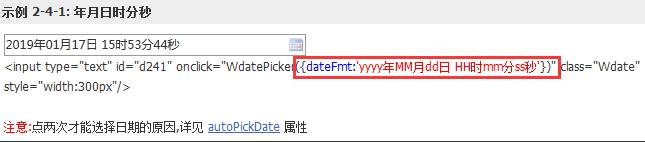

# 1. 出货表

> 进出口贸易术语
>
> FOB是成交方式的一种，全称Free on board，就是装运港交货，按此术语成交，由买方负责派船接运货物，卖方应在合同规定的装运港和规定的期限内，将货物装上买方指定的船只，并及时通知买方。货物在装船时越过船舷,风险即由卖方转移至买方。
>
> Cost and Freight（CFR）成本加运费价，又称运费在内价，在装运港货物越过船舷卖方即完成交货，卖方必须支付将货物运至指定的目的港所需的运费和费用。简单理解 CFR价=FOB价+租船订舱费+装运港至目的港的运费。
>
> Cost,Insurance and Fright (CIF) 成本加保险费、运费价，在装运港当货物越过船舷时卖方即完成交货，卖方必须支付将货物运至指定目的港所需的运费和费用，卖方必须办理买方货物在运输途中灭失或损坏风险的海运保险，卖方订立保险合同并支付保险费，但交货后货物灭失或损坏的风险及由于各种原因造成的任何额外费用。
>
>
> L/C是信用证，全称Letter of credit，是支付方式的一种，指银行(开证银行)(opening bank)询顾客(通常为买方)的请求与指示，向第三人(通常为卖方)所签发的一种文据(instruments)或函件(letter)，其内容包括申请人名称、受益人(beneficiary)、发信日期、交易货物名称、数量、价格、贸易条件、受益人应开汇票的要求(称发票条款)，押汇时应付之单据、装运日期、有效期限与开户银行给押汇银行(negotiating bank)或其他关系人之条款。目前国内绝大部分进出口贸易是通过信用证支付的。
>
> T/T是电汇，全称Telegraphic Transfer，是支付方式的一种。汇出行应汇款人申请，拍发加押电报/电传或SWIFT给在另一国家的分行或代理行(即汇入行)指示解付一定金额给收款人的一种汇款方式。我国的进出口贸易这种支付方式使用频繁程度仅次于信用证。


## 1.1  什么是出货表？

  出货表：根据合同和指定的船期月份，统计当月的出货情况。 

  这种月统计在企业中最常见，例如日、周、月、季度、年报表。 

## 1.2  需求分析

|      | **用户需求**               | **分析结果**                        | **考核点**                |
| ---- | -------------------------- | ----------------------------------- | ------------------------- |
| 1    | 按月导出出货表信息         | 设置统计年月                        | 日期控件使用              |
| 2    | 出货表包括：合同、货物信息 | 按月得到多个合同以及合同下的货物    | 连接查询、mysql日期格式化 |
| 3    | 打印：表格标题、单元格样式 | POI程序实现设置标题样式、单元格样式 | poi设置样式               |

## 1.3  跳转到导出页面

### 1.3.1   jsp

修改cargo/left.jsp

```jsp
<shiro:hasPermission name="出货表">
<li><a href="${ctx}/outProduct/toedit" onclick="linkHighlighted(this)" target="main" id="aa_2">出货表</a></li>
</shiro:hasPermission>

```

### 1.3.2   controller

```java
@Controller
@RequestMapping("/outProduct")
public class OutProductController {

   //跳转到导出页面
    @RequestMapping("/toedit")
    public String toedit() throws Exception {
        return "cargo/outproduct/jOutProduct";
    }
}

```

## 1.4  导出出货表

### 1.4.1   pojo

出货表单独的VO对象，没有数据库表：

1. 日期类型直接转成串，VO对象也改成字符串类型；

2. 直接将数量和单位拼接成字符串；

```java
public class OutProduct {

    private String customName;
    private String contractNo;
    private String deliveryPeriod;
    private String shipTime;
    private String tradeTerms;
    private String factoryName;
    private String productNo;
    private String cnumber;

    public String getCustomName() {
        return customName == null ? "" : customName;
    }

    public void setCustomName(String customName) {
        this.customName = customName;
    }

    public String getContractNo() {
        return contractNo == null ? "" : contractNo;
    }

    public void setContractNo(String contractNo) {
        this.contractNo = contractNo;
    }

    public String getDeliveryPeriod() {
        return deliveryPeriod == null ? "" : deliveryPeriod;
    }

    public void setDeliveryPeriod(String deliveryPeriod) {
        this.deliveryPeriod = deliveryPeriod;
    }

    public String getShipTime() {
        return shipTime == null ? "" : shipTime;
    }

    public void setShipTime(String shipTime) {
        this.shipTime = shipTime;
    }

    public String getTradeTerms() {
        return tradeTerms == null ? "" : tradeTerms;
    }

    public void setTradeTerms(String tradeTerms) {
        this.tradeTerms = tradeTerms;
    }

    public String getFactoryName() {
        return factoryName == null ? "" : factoryName;
    }

    public void setFactoryName(String factoryName) {
        this.factoryName = factoryName;
    }

    public String getProductNo() {
        return productNo == null ? "" : productNo;
    }

    public void setProductNo(String productNo) {
        this.productNo = productNo;
    }

    public String getCnumber() {
        return cnumber == null ? "" : cnumber;
    }

    public void setCnumber(String cnumber) {
        this.cnumber = cnumber;
    }
}

```

### 1.4.2   mapper

创建OutProductMapper.xml

```xml
<?xml version="1.0" encoding="UTF-8" ?>
<!DOCTYPE mapper PUBLIC "-//mybatis.org//DTD Mapper 3.0//EN" "http://mybatis.org/dtd/mybatis-3-mapper.dtd" >
<mapper namespace="cn.yunhe.mapper.OutProductMapper" >
    <resultMap id="listOutProductByMonthBaseResult" type="cn.yunhe.pojo.OutProduct">
        <result column="custom_name" property="customName" jdbcType="VARCHAR"/>
        <result column="contract_no" property="contractNo" jdbcType="VARCHAR"/>
        <result column="delivery_period" property="deliveryPeriod" jdbcType="VARCHAR"/>
        <result column="ship_time" property="shipTime" jdbcType="VARCHAR"/>
        <result column="trade_terms" property="tradeTerms" jdbcType="VARCHAR"/>
        <result column="factory_name" property="factoryName" jdbcType="VARCHAR"/>
        <result column="product_no" property="productNo" jdbcType="VARCHAR"/>
        <result column="cnumber" property="cnumber" jdbcType="VARCHAR"/>
    </resultMap>
    <select id="listOutProductByMonth" parameterType="String" resultMap="listOutProductByMonthBaseResult">
        SELECT
              cc.custom_name,
              cc.contract_no,
              DATE_FORMAT(cc.delivery_period,'%Y-%m-%d') delivery_period,
              DATE_FORMAT(cc.ship_time, '%Y-%m-%d') ship_time,
              cc.trade_terms,
              cpc.factory_name,
              cpc.product_no,
              CONCAT(cpc.cnumber,cpc.packing_unit) cnumber
        FROM
            contract_c cc
        LEFT JOIN contract_product_c cpc ON cc.CONTRACT_ID = cpc.CONTRACT_ID
        where DATE_FORMAT(cc.SHIP_TIME,'%Y-%m') = #{inputDate}
    </select>
</mapper>

```

 方式二:通过为查询的字段起别名的方式解决字段名称与属性名称不一致的问题

```xml
<?xml version="1.0" encoding="UTF-8" ?>
<!DOCTYPE mapper PUBLIC "-//mybatis.org//DTD Mapper 3.0//EN" "http://mybatis.org/dtd/mybatis-3-mapper.dtd" >
<mapper namespace="cn.yunhe.mapper.OutProductMapper" >
  <select id="listOutProductByMonth" parameterType="java.lang.String" resultType="cn.yunhe.pojo.OutProduct">
       SELECT
              cc.custom_name customName,
              cc.contract_no contractNo,
              DATE_FORMAT(cc.delivery_period,'%Y-%m-%d') deliveryPeriod,
              DATE_FORMAT(cc.ship_time, '%Y-%m-%d') shipTime,
              cc.trade_terms tradeTerms ,
              cpc.factory_name factoryName,
              cpc.product_no productNo,
              CONCAT(cpc.cnumber,cpc.packing_unit) cnumber
        FROM
            contract_c cc
        LEFT JOIN contract_product_c cpc ON cc.CONTRACT_ID = cpc.CONTRACT_ID
        where DATE_FORMAT(cc.SHIP_TIME,'%Y-%m') =#{inputDate}
  </select>
</mapper>
```


创建OutProductMapper

```java

public interface OutProductMapper {

    List<OutProduct> listOutProductByMonth(String inputDate);
}

```

### 1.4.3   service

新建OutProductServiceImpl

```java
@Service
public class OutProductServiceImpl implements OutProductService {

    @Autowired
    private OutProductMapper outProductMapper;

    @Override
    public List<OutProduct> getOutProductByMonth(String inputDate) throws Exception {
        return outProductMapper.getOutProductByMonth(inputDate);
    }
}

```

### 1.4.4   controller

```java

@Controller
@RequestMapping("/outProduct")
public class OutProductController {

    @Autowired
    private OutProductService outProductService;

    //跳转出货表页
    @RequestMapping("/toedit")
    public String toedit(){
        return "cargo/outproduct/jOutProduct";
    }

    //导出出货表
    @RequestMapping("/print")
    public void print(String inputDate,HttpServletRequest request, HttpServletResponse response)throws Exception{
        //1、查询数据
        List<OutProduct> outProductList = outProductService.listOutProductByMonth(inputDate);

        //2、获得excel的模板
        String realPath = request.getSession().getServletContext().getRealPath("/");
        String filePath = "/tpl/tOUTPRODUCT.xls";

        ExportExcelUtil excelUtil = new ExportExcelUtil();

        File excelTplFile = excelUtil.getExcelTplFile(realPath, filePath);
        //工作簿
        Workbook workbook = excelUtil.getWorkbook(excelTplFile);
        //设置样式
        excelUtil.setSimpleCellStyle(workbook);
        Sheet sheet = excelUtil.getSheet(workbook, "Sheet1");

        //设置标题
        Row row_title = excelUtil.getRow(sheet,1);
        Cell cell = excelUtil.getCell(row_title, 2);
        inputDate = inputDate.replace("-","年")+"月份";
        cell.setCellValue(inputDate+"出货表");
        //样式
        CellStyle cs = workbook.createCellStyle();

        cs.setAlignment(CellStyle.ALIGN_CENTER); // 居中
        //生成一个字体
        HSSFFont font = (HSSFFont) workbook.createFont();
        font.setColor(HSSFColor.BLACK.index);//HSSFColor.VIOLET.index //字体颜色
        font.setFontHeightInPoints((short)18);
        font.setBoldweight(HSSFFont.BOLDWEIGHT_BOLD);         //字体增粗
        //把字体应用到当前的样式
        cs.setFont(font);
        cell.setCellStyle(cs);

        //3、把查询到的数据写到excel模板里
        for (int i = 0; i < outProductList.size(); i++) {
            OutProduct OutProduct =  outProductList.get(i);
            //行
            Row row = excelUtil.createRow(sheet);
            //单元格
            Cell cell1 = excelUtil.createCell(row, 1);
            cell1.setCellValue(OutProduct.getCustomName());

            //单元格
            Cell cell2 = excelUtil.createCell(row, 2);
            cell2.setCellValue(OutProduct.getContractNo());

            //单元格
            Cell cell3 = excelUtil.createCell(row, 3);
            cell3.setCellValue(OutProduct.getProductNo());

            //单元格
            Cell cell4 = excelUtil.createCell(row, 4);
            cell4.setCellValue(OutProduct.getCnumber());

            //单元格
            Cell cell5 = excelUtil.createCell(row, 5);
            cell5.setCellValue(OutProduct.getFactoryName());

            //单元格
            Cell cell6 = excelUtil.createCell(row, 6);
            cell6.setCellValue(OutProduct.getDeliveryPeriod());

            //单元格
            Cell cell7 = excelUtil.createCell(row, 7);
            cell7.setCellValue(OutProduct.getShipTime());

            //单元格
            Cell cell8 = excelUtil.createCell(row, 8);
            cell8.setCellValue(OutProduct.getTradeTerms());

        }


        //4、把写好的excel返回到客户端
        //把写好的excel发送到客户端
        String fileName="tOUTPRODUCT.xls";
        response.setContentType("application/ms-excel");
        response.setHeader("Content-disposition", "attachment;filename="+fileName);
        ServletOutputStream ouputStream = response.getOutputStream();
        workbook.write(ouputStream);
        ouputStream.flush();
        ouputStream.close();
    }

}

```

 

### 1.4.5   jsp

购销合同**月统计**需要自定义船期的日期格式为：yyyy-MM

 

1、My97Date自定义日期格式的方式：



 

2、修改outproduct/jOutProduct.jsp

```jsp
<tr>
         <td class="columnTitle">船期：</td>
         <td class="tableContent">
             <input type="text" style="width:90px;" name="inputDate"  
                                       onclick="WdatePicker({readOnly:true,dateFmt:'yyyy-MM'});"/>
       </td>
</tr> 

```

# 2. 统计分析 

##  2. 1  统计分析的好处？

​    如何让数据说话？ 

　如何挖掘基础数据的价值？

##  2.2  图形统计报表

​    图形统计报表用来将企业中现有的数据进行有效的整合，快速准确的提供报表并提出决策依据，帮助企业做出明智的业务经营决策。

　　下面的统计报表就是我们充分挖掘企业的基础信息，从中分析出更有价值的信息，为企业业务经营决策提供直观的数据支持。例如通过分析我们能知道我们的重点客户，能知道我们最受欢迎的产品是哪些，从而在这些方面投入更多的资金和人力，收益也将更大。


# 3.  echarts

## 3.1   什么是echarts？

​    ECharts，一个使用 JavaScript 实现的开源可视化库，可以流畅的运行在 PC 和移动设备上，兼容当前绝大部分浏览器（IE8/9/10/11，Chrome，Firefox，Safari等），底层依赖轻量级的矢量图形库 ZRender，提供直观，交互丰富，可高度个性化定制的数据可视化图表。

 

## 3.2   echarts的可视化图表

​    ECharts 提供了常规的折线图、柱状图、散点图、饼图、K线图，用于统计的盒形图，用于地理数据可视化的地图、热力图、线图，用于关系数据可视化的关系图、treemap、旭日图，多维数据可视化的平行坐标，还有用于 BI 的漏斗图，仪表盘，并且支持图与图之间的混搭。

## 3.3   echarts下载

echarts官网：

 [https://echarts.baidu.com](https://echarts.baidu.com/)

https://echarts.apache.org/zh/index.html


## 3.4   引入 echarts

ECharts 3 开始引入方式简单了很多，只需要像普通的 JavaScript 库一样用 script 标签引入。

```html
 <!DOCTYPE html>
  <html>
  <head>
     <meta charset="utf-8">
     <!-- 引入 ECharts 文件 -->
     <script src="echarts.min.js"></script>
  </head>
  </html>

```

## 3.5   绘制一个简单的图表

在绘图前我们需要为 ECharts 准备一个具备高宽的 DOM 容器。

```html
 <body>
    <!-- 为 ECharts 准备一个具备大小（宽高）的 DOM -->
    <div id="main" style="width: 600px;height:400px;"></div>
 </body>

```

然后就可以通过 [echarts.init](https://echarts.baidu.com/api.html#echarts.init) 方法初始化一个 echarts 实例并通过 [setOption](https://echarts.baidu.com/api.html#echartsInstance.setOption) 方法生成一个简单的柱状图，下面是完整代码。

```html
<!DOCTYPE html>
 <html>
 <head>
    <meta charset="utf-8">
    <title>ECharts</title>
    <!-- 引入 echarts.js -->
    <script src="echarts.min.js"></script>
 </head>
 <body>
    <!-- 为ECharts准备一个具备大小（宽高）的Dom -->
    <div id="main" style="width: 600px;height:400px;"></div>
    <script type="text/javascript">
        // 基于准备好的dom，初始化echarts实例
        var myChart = echarts.init(document.getElementById('main'));

        // 指定图表的配置项和数据
        var option = {
            title: {
                text: 'ECharts 入门示例'
            },
            tooltip: {},
            legend: {
                data:['销量']
            },
            xAxis: {
                data: ["衬衫","羊毛衫","雪纺衫","裤子","高跟鞋","袜子"]
            },
            yAxis: {},
            series: [{
                name: '销量',
                type: 'bar',
                data: [5, 20, 36, 10, 10, 20]
            }]
        };

        // 使用刚指定的配置项和数据显示图表。
        myChart.setOption(option);
    </script>
 </body>
 </html>

```

 

这样你的第一个图表就诞生了！


#  4.  厂家销售情况统计 

修改pages\stat\left.jsp

```jsp
<shiro:hasPermission name="生产厂家销售情况">
		<li><a href="${ctx}/" onclick="linkHighlighted(this)" target="main" id="aa_1">生产厂家销售情况</a></li>
</shiro:hasPermission>
<shiro:hasPermission name="产品销售排行">
		<li><a href="${ctx}/" onclick="linkHighlighted(this)" target="main" id="aa_2">产品销售排行</a></li>
</shiro:hasPermission>
<shiro:hasPermission name="系统访问压力图">
		<li><a href="${ctx}/" onclick="linkHighlighted(this)" target="main" id="aa_2">系统访问压力图</a></li>
</shiro:hasPermission>
```


## 4.1   pojo

```java

package cn.yunhe.pojo;

/**
 * 封装Echarts展示所需要的数据
 */
public class EchartsData {
    private Integer value;
    private String name;

    public Integer getValue() {
        return value;
    }

    public void setValue(Integer value) {
        this.value = value;
    }

    public String getName() {
        return name;
    }

    public void setName(String name) {
        this.name = name;
    }
}

```

 

## 4.2   mapper

修改ContractProductCMapper.xml

```xml
  <!--统计厂家的销售情况-->
  <select id="listFactorySaleData" resultType="cn.yunhe.pojo.EchartsData">
      select count(1) value,FACTORY_NAME name from contract_product_c GROUP BY FACTORY_NAME
  </select>

```

修改ContractProductCMapper

```java
 /**
     * 查询厂家的销售统计
     * @return
     * @throws Exception
     */
    List<EchartsData> listFactorySaleData() throws Exception;
```

 

## 4.3   service

```java

@Service
public class StatChartServiceImpl implements StatChartService {
    @Autowired
    private ContractProductCMapper contractProductCMapper;

    /**
     * 生产厂家销售情况
     * @return
     * @throws Exception
     */
    public List<EchartsData> listFactorySaleData() throws Exception {
        return contractProductCMapper.listFactorySaleData();
    }
}

```

 

## 4.4   controller

```java
@Controller
@RequestMapping("/stat")
public class StatChartController {
    @Autowired
    private StatChartService statChartService;

    /**
     * 生产厂家销售排行
     * @return
     */
    @RequestMapping("/toFactorySale")
    public String toFactorySale(){
        return "stat/chart/SaleView";
    }

    /**
     * 获取生产厂家销售排行
     * @return
     */
    @RequestMapping("/getSaleData")
    @ResponseBody
    public List<EchartsData> getSaleData() throws Exception{
       return  statChartService.listFactorySaleData();
    }

}


```

 

## 4.5   jsp

修改SaleView.jsp

```jsp
<body>
<!-- 为ECharts准备一个具备大小（宽高）的Dom -->
<div id="main" style="width: 600px;height:400px;"></div>
<script type="text/javascript">
    $(function(){
        $.ajax({
            url:'${ctx}/statChart/getSaleData',
            type:'post',
            success:showChars
        });
    });
    function showChars(data) {
       // 基于准备好的dom，初始化echarts实例
        var myChart = echarts.init(document.getElementById('main'));

        // 指定图表的配置项和数据
        var option = {
            //标题
            title : {
                text: '厂家销售情况统计',
                x:'center'
            },
            //提示框
            tooltip : {
                trigger: 'item',
                formatter: "{a} <br/>{b} : {c} ({d}%)"
            },
            //图例组件的排版方式
            legend: {
                orient: 'vertical',
                left: 'left',
            },
            series : [
                {
                    name: '厂家销售情况',//a
                    type: 'pie',
                    radius : '55%',//半径
                    center: ['50%', '60%'],//坐标
                    data:data
                }
            ]
        };

        // 使用刚指定的配置项和数据显示图表。
        myChart.setOption(option);
    }
</script>
</body>
</html>

```